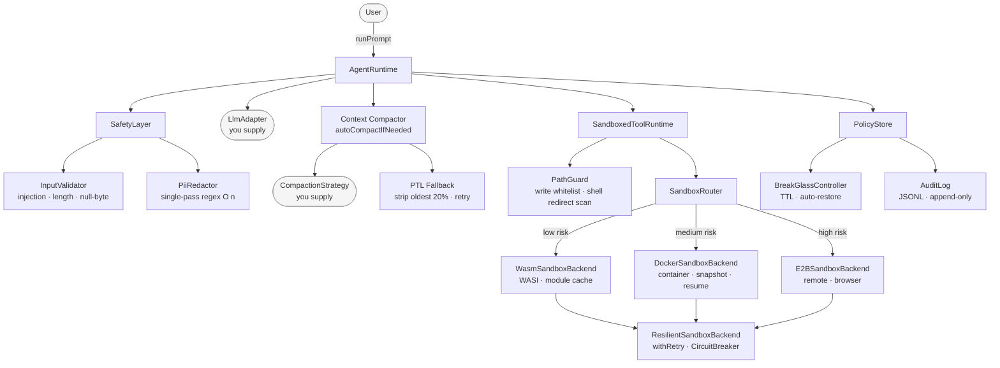
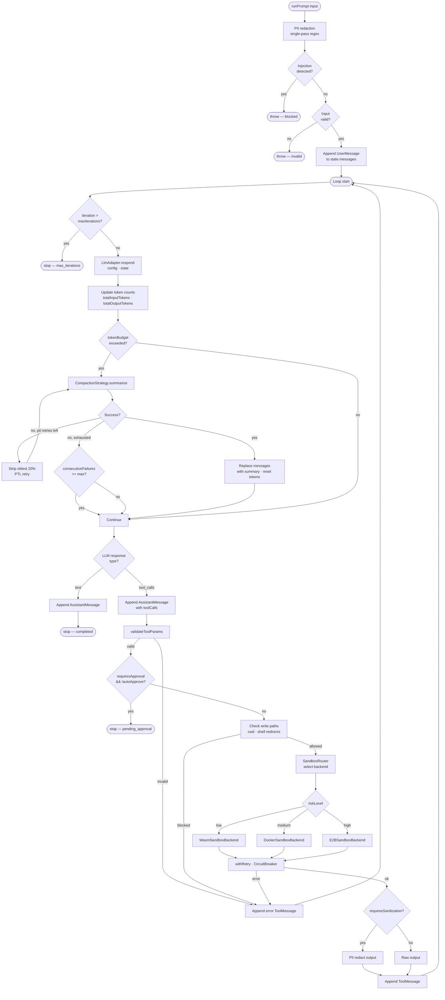

# Titanclaw-ts

A TypeScript Agent SDK with explicit runtime semantics, multi-layer security, and sandboxed tool execution. Not built on LangGraph — the loop, state, and safety boundaries are all plain code.

---

## Architecture overview



---

## Modules

### `src/types.ts` — Core types

`AgentConfig` holds immutable session parameters (threadId, systemPrompt, availableTools, etc.). `AgentState` holds mutable runtime state (messages, iteration, tokens, signals). They are intentionally separate so the loop can never accidentally overwrite config fields.

### `src/runtime.ts` — `AgentRuntime`

The main loop:

```
while signal !== "stop":
  1. ask LLM → text or tool_calls
  2. track token usage
  3. run context compaction if needed
  4. if text → stop
  5. if tool_calls → validate → approval check → execute → append results
```

Constructor:

```ts
new AgentRuntime(llm, tools, safety, configInput, hooks?, policyStore?, compactionStrategy?, compactionOptions?)
```

### `src/sandbox/` — Three-layer sandbox

| Backend | Risk level | Use case |
|---------|-----------|---------|
| `WasmSandboxBackend` | low | registered WASI commands only; in-memory + disk module cache |
| `DockerSandboxBackend` | medium | filesystem workloads; `docker commit` snapshot + resume |
| `E2BSandboxBackend` | high | remote browser isolation |

`SandboxRouter` picks the backend from the tool handler's `policy` field. `SandboxedToolRuntime` enforces file write whitelists and checks shell redirect targets (`>`, `>>`, `tee`) via `extractShellWriteTargets()`.

**Directory isolation** — pass `directories: { logs, cache, workspace }` to keep each concern in its own subtree.

**File write whitelist** — pass `allowedWritePaths: ["/workspace/out"]` to restrict all write operations, including shell redirects, to explicit paths.

### `src/policy/` — Policy management

```ts
const store = new PolicyStore({ maxIterations: 20, autoApproveTools: false });

// Controlled change with audit trail
store.set({ autoApproveTools: true }, "reason");

// Snapshot + rollback
const snap = store.snapshot();
store.rollback(snap.id);
```

**Break-glass** — time-limited emergency permission elevation, host-triggered, auto-restores on TTL:

```ts
const bg = new BreakGlassController(store, auditLog);
bg.activate({ autoApproveTools: true }, { ttlMs: 60_000, activatedBy: "oncall" });
// Automatically rolls back after 60 seconds
```

All changes (policy_change, break_glass_activated, break_glass_expired, rollback) are written to an append-only JSONL audit log.

### `src/safety/` — Multi-layer security validation

- **Injection detection** — 10 patterns (ignore-instructions, jailbreak tokens, prompt override, role-play escalation, etc.); blocking
- **PII redaction** — 8 patterns (email, phone, SSN, credit card, IP, API key, JWT, password); combined into a single regex at construction time for O(text) performance
- **Path escape blocking** — 6 scenarios (`../`, null byte, absolute override, `%2F`, double-encoded, Windows `..\\`)

```ts
const safety = new SafetyLayer();
const result = safety.checkInput(userText); // redacts PII, then checks injection
```

### `src/resilience/` — Circuit breaker + retry

**`CircuitBreaker`** — three states (closed → open → half-open) with rolling failure window:

```ts
const cb = new CircuitBreaker("docker", { failureThreshold: 5, successThreshold: 2, cooldownMs: 60_000, windowMs: 60_000 });
await cb.call(() => backend.execute(req));
```

**`withRetry`** — exponential backoff with jitter and a `retryIf` filter:

```ts
await withRetry(() => backend.execute(req), { maxAttempts: 3, baseDelayMs: 100, maxDelayMs: 10_000, jitter: true });
```

**`ResilientSandboxBackend`** — wraps any `SandboxBackend` with retry inside the circuit breaker. All methods delegate through `breaker.call(() => withRetry(...))`.

### `src/context/` — Context compression

Triggered after each LLM turn when `totalInputTokens >= tokenBudget` or `state.needsCompaction` is set.

```
attempt summarize(messages)
  → on failure: strip oldest 20% (PTL), retry up to maxPtlRetries
  → on exhaustion: increment consecutiveFailures
  → if consecutiveFailures >= maxConsecutiveFailures: stop trying (circuit open)
on success: replace history with [system messages] + [summary message], reset tokens
```

Supply a `CompactionStrategy` that calls your LLM:

```ts
const strategy: CompactionStrategy = {
  async summarize(messages) {
    return myLlm.summarize(messages);
  },
};
```

---

## Request lifecycle



A single `runPrompt()` call goes through the following stages:

**1. Safety gate**
- `SafetyLayer.checkInput()` runs PII redaction (single combined regex, O(n)) then injection detection
- `InputValidator` rejects empty content, oversized input, and null bytes
- Any injection pattern match throws immediately — request does not enter the loop

**2. Message enqueue**
- Sanitized content is wrapped as a `UserMessage` and appended to `state.messages`

**3. Main loop — repeated each iteration**

**3a. Iteration cap check**
- `iteration > effectiveMaxIterations` → signal = stop
- `effectiveMaxIterations` reads from `PolicyStore` first, falls back to `AgentConfig`

**3b. LLM call**
- `LlmAdapter.respond(config, state)` returns either text or tool calls
- `state.totalInputTokens` and `totalOutputTokens` are updated from usage metadata

**3c. Context compaction (optional)**
- Triggers when `totalInputTokens >= tokenBudget` or `state.needsCompaction` is set
- Calls `CompactionStrategy.summarize(messages)`
- On failure: strips oldest 20% of messages (PTL) and retries up to `maxPtlRetries`
- After `maxConsecutiveFailures` failures: circuit opens, compaction is skipped for the session
- On success: `messages` is replaced with `[system…] + [summary]`, token count resets to 0

**3d. Text response**
- Appends `AssistantMessage` → signal = stop → loop ends

**3e. Tool call path**
- **Parameter validation** — `validateToolParams()` failure appends an error `ToolMessage` and skips execution
- **Approval check** — `requiresApproval && !autoApproveTools` suspends the loop; resumes after host calls `approvePendingTool()`
- **Write path check** — `isPathAllowed(cwd)` and `extractShellWriteTargets()` scan shell redirect targets against the whitelist
- **Backend routing** via `SandboxRouter`:
  - `riskLevel: low` → `WasmSandboxBackend` (WASI sandbox, registered commands only)
  - `riskLevel: medium` → `DockerSandboxBackend` (container isolation, snapshot/resume)
  - `riskLevel: high` → `E2BSandboxBackend` (remote isolation, browser support)
- **Resilience** (when `ResilientSandboxBackend` is enabled): `withRetry` applies exponential backoff (`baseDelay * 2^attempt` with jitter); `CircuitBreaker` tracks failures in a rolling window and opens after threshold
- **Output sanitization** — `requiresSanitization` routes output through `sanitizeToolOutput()` for PII redaction
- Appends `ToolMessage` → back to 3a

**Cross-cutting concerns**

| Where | What |
|-------|------|
| Entry | Injection detection + PII redaction |
| Each iteration | Token accounting + compaction trigger |
| Before tool execution | Parameter validation + approval gate + write path whitelist |
| Backend calls | Exponential backoff retry + three-state circuit breaker |
| Tool output | PII redaction |
| Throughout | `PolicyStore` dynamically controls `maxIterations`, `autoApproveTools`, `allowedWritePaths`; `BreakGlassController` provides time-limited policy relaxation; `AuditLog` records every policy change |

---

## Factory

`createSandboxedRuntime` wires everything together:

```ts
import { createSandboxedRuntime } from "./src/factory.js";

const runtime = createSandboxedRuntime({
  llm,
  safety,
  config: { maxIterations: 12, autoApproveTools: false },
  wasmCommands: {
    hello: { modulePath: "/path/to/hello.wasm" },
  },
  directories: { logs: "/var/log/agent", cache: "/var/cache/agent", workspace: "/workspace" },
  allowedWritePaths: ["/workspace"],
  policyStore: store,
  compactionStrategy: strategy,
  compactionOptions: { tokenBudget: 150_000 },
});

await runtime.runPrompt("Run the demo");
```

---

## Quick-start (minimal)

```ts
import { AgentRuntime } from "./src/runtime.js";
import { SafetyLayer } from "./src/safety/safety-layer.js";
import type { LlmAdapter, LlmTurnResult, ToolRuntime } from "./src/types.js";

const llm: LlmAdapter = {
  async respond(_config, state) {
    const last = state.messages.at(-1);
    if (last?.role === "tool") return { type: "text", text: "Done." };
    return { type: "tool_calls", toolCalls: [{ id: "c1", name: "echo", args: { text: "hi" } }] };
  },
};

const tools: ToolRuntime = {
  listTools: () => [{ name: "echo", description: "echo text", parameters: {} }],
  execute: async (_name, params) => ({ output: String(params.text ?? "") }),
};

const runtime = new AgentRuntime(llm, tools, new SafetyLayer(), { maxIterations: 4, autoApproveTools: true });
await runtime.runPrompt("Say hello");
```

---

## Test suite

```bash
npm run build
node --test test/safety.test.mjs       # 32 tests: injection, PII, path escape, validator
node --test test/resilience.test.mjs   # 18 tests: circuit breaker, retry, resilient backend
node --test test/context.test.mjs      # 11 tests: compaction trigger, PTL, circuit breaker
node --test test/session-manager.test.mjs
node --test test/router.test.mjs
node --test test/wasm-backend.test.mjs
node --test test/docker-backend.test.mjs
node --test test/e2b-backend.test.mjs
node --test test/tool-runtime.test.mjs
```

---

## WASI example

```bash
wat2wasm examples/hello.wat -o examples/hello.wasm
```

```ts
import { createDemoRuntime } from "./src/demo.js";
const runtime = createDemoRuntime("/path/to/hello.wasm");
await runtime.runPrompt("Run the demo");
```
