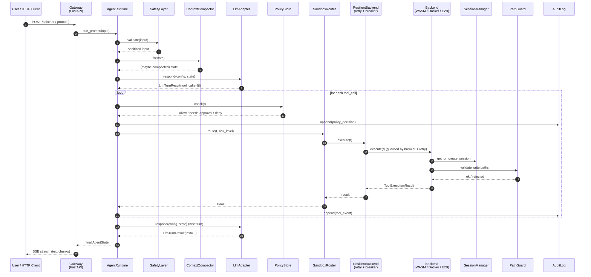
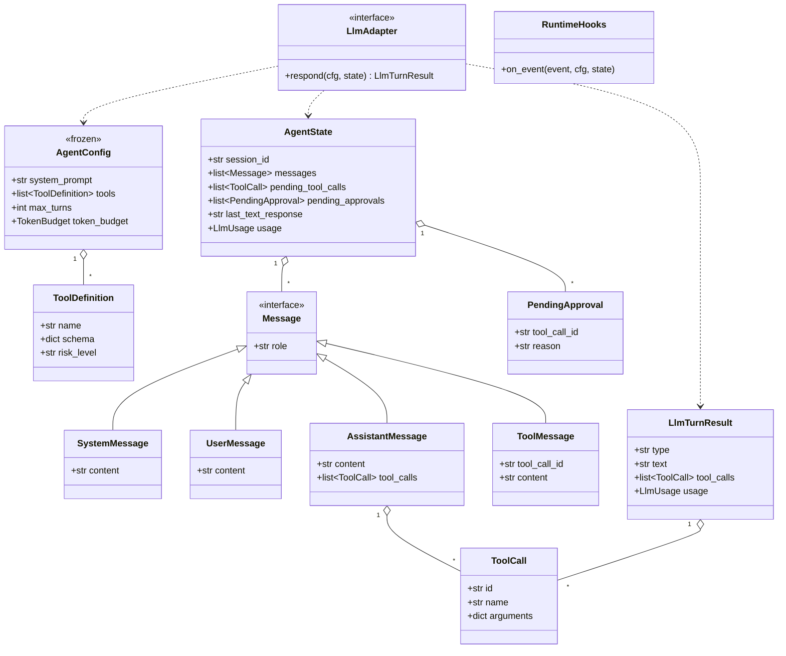

# TitanX

TitanX is a Python Agent SDK for building autonomous agents with explicit runtime semantics, multi-layer safety, policy controls, context compaction, and sandboxed tool execution.

This repository now tracks the Python implementation. The previous TypeScript implementation is kept next to it as `../TitanX-ts/` for reference.

## Quick Start

```bash
python -m venv .venv
source .venv/bin/activate
pip install -e ".[dev]"
python demo.py
```

## Gateway Demo

```bash
python run_gateway.py
```

The gateway starts on `http://localhost:3000`.

## Project Layout

| Path | Purpose |
| --- | --- |
| `titanx/runtime.py` | Main agent runtime loop |
| `titanx/types.py` | Core dataclasses and adapter interfaces |
| `titanx/factory.py` | Default runtime wiring |
| `titanx/safety/` | Input validation, redaction, and safety checks |
| `titanx/sandbox/` | Tool runtime, router, path guard, and backend interfaces |
| `titanx/resilience/` | Retry and circuit breaker support |
| `titanx/context/` | Token tracking and compaction |
| `titanx/policy/` | Policy store, audit log, and break-glass controls |
| `titanx/storage/` | Storage backend interfaces and implementations |
| `titanx/retrieval/` | Hybrid retrieval and MMR ranking |
| `titanx/tools/` | Optional tool catalogs, including IronClaw-inspired WASM tools |
| `titanx/gateway/` | FastAPI gateway and UI serving |
| `titanx/audit.py` | Programmatic security posture audit (CLI: `titanx audit`) |
| `titanx/cli.py` | Command-line entry point for operator preflight |
| [`SECURITY.md`](./SECURITY.md) | Trust model, in-scope defenses, out-of-scope assumptions |

## Architecture

### 1. Layered Module View

```
╔══════════════════════════════════════════════════════════════════════════════╗
║                            CLIENT / ENTRYPOINT                                ║
║                                                                               ║
║   demo.py          run_gateway.py (FastAPI)          custom scripts           ║
║      │                    │                                │                  ║
║      └────────────────────┴────────────┬───────────────────┘                  ║
╚═══════════════════════════════════════ │ ═════════════════════════════════════╝
                                         ▼
╔══════════════════════════════════════════════════════════════════════════════╗
║                          GATEWAY (titanx/gateway/)                            ║
║                                                                               ║
║   server.py  (FastAPI app)                                                    ║
║     ├─ routes/chat.py    POST /api/chat    (SSE stream)                       ║
║     ├─ routes/memory.py  GET/POST /api/memory                                 ║
║     ├─ routes/jobs.py    GET /api/jobs                                        ║
║     └─ routes/logs.py    GET /api/logs                                        ║
║   Static UI served from ../ui/                                                ║
╚═══════════════════════════════════════ │ ═════════════════════════════════════╝
                                         ▼
╔══════════════════════════════════════════════════════════════════════════════╗
║                     FACTORY  (titanx/factory.py)                              ║
║            create_sandboxed_runtime(CreateSandboxedRuntimeOptions)            ║
║                   Wires all components, returns AgentRuntime                  ║
╚═══════════════════════════════════════ │ ═════════════════════════════════════╝
                                         ▼
╔══════════════════════════════════════════════════════════════════════════════╗
║                    CORE RUNTIME  (titanx/runtime.py)                          ║
║                                                                               ║
║          AgentRuntime.run_prompt(user_input)                                  ║
║                  │                                                            ║
║                  ▼                                                            ║
║   ┌──────────────────────────────────────────────────────────────────┐       ║
║   │  Loop (signal: continue | stop | interrupt)                      │       ║
║   │                                                                  │       ║
║   │    1. SafetyLayer.validate(input)    ─► injection / PII / paths  │       ║
║   │    2. ContextCompactor.fit(state)    ─► compact if over budget   │       ║
║   │    3. LlmAdapter.respond(cfg, state) ─► user-supplied LLM        │       ║
║   │    4. if tool_calls:                                             │       ║
║   │         ├─ PolicyStore.check()       ─► approve / break-glass    │       ║
║   │         ├─ SandboxRouter.execute()   ─► route to backend         │       ║
║   │         └─ AuditLog.append()         ─► JSONL append             │       ║
║   │    5. Append result to AgentState, decide next signal            │       ║
║   └──────────────────────────────────────────────────────────────────┘       ║
║                                                                               ║
║   State model:  AgentConfig (frozen=True)  +  AgentState (mutable)            ║
║   types.py:     Message / ToolCall / LlmAdapter / RuntimeHooks / ...          ║
╚═══════════════════════════════════════ │ ═════════════════════════════════════╝
                                         ▼
┌─────────────────┬────────────────┬─────────────────┬──────────────┬──────────────┐
│   SAFETY        │   CONTEXT      │   POLICY        │   RETRIEVAL  │   STORAGE    │
│ (safety/)       │ (context/)     │ (policy/)       │ (retrieval/) │ (storage/)   │
├─────────────────┼────────────────┼─────────────────┼──────────────┼──────────────┤
│ safety_layer    │ compactor      │ policy_store    │ hybrid       │ pg_vector    │
│ validator       │   summarize    │   snapshots +   │   vec + FTS  │   asyncpg    │
│ redactor        │   PTL fallback │   rollback      │ mmr          │ libsql       │
│ patterns        │ types          │ break_glass     │ types        │   Turso/SQLite│
│  (injection /   │   TokenBudget  │ audit_log(JSONL)│ EmbeddingProv│  StorageBackend│
│   PII / path)   │                │ types           │              │                │
└─────────────────┴────────────────┴─────────────────┴──────────────┴──────────────┘

╔══════════════════════════════════════════════════════════════════════════════╗
║                     SANDBOX LAYER  (titanx/sandbox/)                          ║
║                                                                               ║
║   SandboxedToolRuntime (tool_runtime.py)                                      ║
║     ├─ PathGuard          fail-closed shlex scan; defence-in-depth only       ║
║     ├─ SessionManager     per-session lifecycle                               ║
║     └─ SandboxRouter  ──► selects backend by risk_level                       ║
║          │                                                                    ║
║          └─► Real boundary: Docker backend mounts / read-only +               ║
║              bind-mounts allowed_write_paths writable (kernel-enforced)       ║
║                                                                               ║
║              ┌──────────────────────┴──────────────────────┐                  ║
║              ▼                                             ▼                  ║
║   ┌─────────────────────┐                     ┌──────────────────────┐       ║
║   │  ResilientBackend   │ ◄── wraps each ──►  │   SandboxBackend     │       ║
║   │  (resilience/)      │     real backend    │   (interface)        │       ║
║   │    ├ CircuitBreaker │                     └──────────┬───────────┘       ║
║   │    │   closed→open→ │                                │                    ║
║   │    │   half-open    │       ┌────────────────────────┼──────────────────┐ ║
║   │    ├ retry          │       ▼                        ▼                  ▼ ║
║   │    │   expo+jitter  │   ┌────────┐              ┌────────┐         ┌──────┐║
║   │    └ _is_retryable  │   │ WASM   │  low-risk    │ Docker │ medium  │ E2B  │║
║   │                     │   │wasmtime│              │aiodocker│        │remote│║
║   └─────────────────────┘   └────────┘              └────────┘         └──────┘║
║                                   ▲                                            ║
║                                   │                                            ║
║                            tools/ironclaw_wasm.py                              ║
║                     (optional IronClaw WASI tool catalog,                      ║
║                        ABI: titanx-wasi-json-argv)                             ║
╚═══════════════════════════════════════════════════════════════════════════════╝
```

### 2. Request Sequence (one user turn with a tool call)



### 3. Core Data Model



### 4. Trust Boundaries & Threat Model

```
 Untrusted ─────────────────────────────────────────────────────────► Trusted

┌──────────┐   ┌─────────────────────────────────┐   ┌────────────────────────┐
│  User    │   │         Host Process            │   │   Isolated Sandbox     │
│  Input   │   │   (your Python service)         │   │   (WASM / Docker /E2B)│
│          │   │                                 │   │                        │
│  prompt  │──►│  ┌──────────┐    ┌───────────┐ │──►│  ┌──────────────────┐ │
│  file    │   │  │ Safety   │──► │ Runtime   │ │   │  │ Tool process /   │ │
│  args    │   │  │ Layer    │    │ Loop      │ │   │  │ wasmtime /       │ │
│          │   │  └──────────┘    └─────┬─────┘ │   │  │ container / e2b  │ │
└──────────┘   │       ▲                │       │   │  └──────────────────┘ │
               │       │                ▼       │   │          ▲             │
  ║ BOUNDARY 1 │       │         ┌──────────┐   │   │          │             │
  ║  all input │       │         │ LLM API  │   │   │          │  BOUNDARY 3 │
  ║  redacted, │       │         │ (remote) │   │   │          │  sandbox    │
  ║  injection │       │         └──────────┘   │   │          │  escape     │
  ║  patterns  │       │                ║       │   │          │  prevention │
  ║  blocked   │       │   BOUNDARY 2   ║       │   │          │             │
               │       │   LLM output   ║       │   │          │             │
               │       │   is untrusted ║       │   │          │             │
               │       │   → safety re- ║       │   │          │             │
               │       │   applied      ║       │   │          │             │
               │       │                ▼       │   │          │             │
               │  ┌──────────┐    ┌───────────┐ │   │          │             │
               │  │ Policy   │◄──►│ Sandbox   │ │   │          │             │
               │  │ Store    │    │ Router    │─┼───┘          │             │
               │  └─────┬────┘    └─────┬─────┘ │              │             │
               │        │               │       │              │             │
               │        ▼               ▼       │              │             │
               │  ┌──────────┐    ┌───────────┐ │              │             │
               │  │AuditLog  │    │PathGuard  │─┼──────────────┘             │
               │  │(JSONL)   │    │           │ │                            │
               │  └──────────┘    └───────────┘ │                            │
               └─────────────────────────────────┘                            │
                                                                              │
  Boundary legend:                                                            │
   1. User → Host:   SafetyLayer validates/redacts (injection, PII, paths)    │
   2. LLM → Host:    LLM output treated as untrusted; re-checked by Safety    │
                     + PolicyStore gates tool calls (approval / break-glass)  │
   3. Host → Sandbox: PathGuard does a fail-closed shlex scan as an early    │
                     filter (NOT a security boundary); SandboxRouter picks    │
                     isolation tier by risk_level; the *authoritative*        │
                     write boundary is the Docker backend mounting / RO +     │
                     bind-mounting allowed_write_paths RW so the kernel       │
                     rejects any write outside the whitelist (EROFS).         │
                     ResilientBackend wraps calls with retry + breaker.       │
```

Trust escalates left-to-right; every boundary crossing is mediated by a guard component. Audit events are appended to JSONL at every policy decision and every tool invocation.

### 5. Production Hardening Hooks

These are the knobs you need to tune the runtime, gateway, and sandbox layers for real deployments. Defaults are tuned for development convenience and are deliberately loud about it (e.g. CORS `*` or missing `api_key` log a startup warning to stderr).

> See [CHANGELOG.md](./CHANGELOG.md) for the version-by-version migration notes.

#### Gateway

```python
from titanx.gateway import GatewayOptions, create_gateway

app = create_gateway(GatewayOptions(
    api_key="...",                       # hmac.compare_digest comparison; required in prod
    allowed_origins=["https://app.example"],   # CORS — never leave as ["*"] in prod
    allowed_methods=["GET", "POST"],
    allowed_headers=["x-api-key", "content-type"],
    max_sessions=1000,                   # bounded LRU; keys past the cap are evicted
    session_idle_ttl_seconds=3600.0,     # idle sessions are reaped on next access
    create_runtime=...,
))
```

The HTTP middleware authenticates every `/api/*` request; the WebSocket handler performs the same `hmac.compare_digest` check inline before `accept()` because Starlette HTTP middleware does not run on WS handshakes. Concurrent `run_prompt` calls against the same `session_id` are serialised by `SessionEntry.lock`, so two parallel POSTs cannot interleave their `state.messages` mutations and break the OpenAI/Anthropic tool-call protocol.

#### Cancellation protocol

When the host (typically the gateway after a client disconnect) cancels the task running `AgentRuntime.run_prompt`, the runtime:

1. Closes the in-flight tool call by appending a synthesised `ToolMessage` carrying `"Tool execution was cancelled before completion."`. Every assistant `tool_call.id` therefore has a matching `ToolMessage`, so the next LLM call (after `resume()`) is still protocol-valid.
2. Sets `state.signal = "interrupt"` and emits `LoopEndEvent(reason="cancelled")` so observers can react symmetrically with the other terminal reasons.
3. Re-raises `asyncio.CancelledError`. Hosts that swallow it leak the cancellation contract — don't.

Calling `runtime.resume()` on an interrupted state continues from the next pending tool. Callers that want a hard reset should drop the runtime instead.

#### Break-glass lifecycle

```python
from titanx.policy import BreakGlassController

bg = BreakGlassController(policy_store)
session = await bg.activate("incident-7421", ttl_ms=10 * 60_000, relaxed_policy=relaxed)

# When the operator is done — restores the original policy AND cancels the timer:
await bg.revoke("operator complete")

# On gateway shutdown, regardless of state:
await bg.aclose()
```

`dispose()` is retained for source-compat but **does not roll back the relaxed policy**; new code must use `revoke()` / `aclose()`. `ttl_ms <= 0` and non-int values raise immediately. Manual revoke and TTL expiry are mutually exclusive (one lock); they cannot double-rollback or double-audit.

#### Audit fan-out

`AuditLog` is the canonical audit pipeline. To mirror entries into a relational store, plug a secondary sink in instead of writing directly to `StorageBackend.save_log` (which would create a second, unreconciled audit stream):

```python
from titanx.policy import AuditLog, storage_secondary_sink

audit = AuditLog(
    "/var/log/titanx/audit.jsonl",
    fsync_policy="interval",
    secondary_sink=storage_secondary_sink(my_storage, session_id=session_id),
)
```

The sink runs serially with `append()`. If it raises once, it is permanently disabled with a stderr warning; the JSONL file remains the durable record either way.

#### Sandbox isolation floor

Tools that must not silently downgrade to a weaker backend during a partial outage should set a hard floor:

```python
from titanx.sandbox import SandboxRouterInput

selection = await router.select(SandboxRouterInput(
    risk_level="high",
    needs_browser=True,
    min_isolation="docker",        # refuses if only WASI is reachable
))
```

If no candidate backend clears the floor, `select()` raises `RuntimeError` with a per-backend rejection trail. An optional `on_selection` callback fires for every successful selection so you can log which backend a tool actually ran on.

#### Sandbox session lifecycle

```python
from titanx.sandbox import SandboxSessionManager

mgr = SandboxSessionManager(
    router,
    workspace_dir="/var/lib/titanx/work",
    policy_store=policy_store,           # live policy lookup; break-glass takes effect
    max_sessions=256,
    idle_ttl_seconds=1800.0,
)
# ...
await mgr.aclose()                       # destroys backend sessions + cleans workspace dirs
```

Constructor-time `allowed_write_paths` is now a fallback only — when a `policy_store` is provided, every `create()` and `write_files()` consults the live policy so a break-glass relaxation reaches new and existing sessions without restart.

#### Filesystem policy: read-only vs read-write

`AgentPolicy` declares the two surfaces independently, mirroring NemoClaw's `filesystem_policy.{read_only,read_write}`:

```python
from titanx.policy.types import AgentPolicy

policy = AgentPolicy(
    allowed_write_paths=["/srv/titanx/work"],     # bind-mounted :rw
    allowed_read_paths=["/srv/titanx/refs"],      # bind-mounted :ro
)
```

`validate_policy` runs the same forbidden-subtree check (`/etc`, `/proc`, `/var/run/...`) against both lists — read-only mounts of host config are still leaks. If a path appears in both lists `DockerSandboxBackend._filesystem_flags` keeps the writable mount and silently drops the read-only duplicate; `audit_policy` flags the overlap so the misconfig surfaces.

#### Docker image digest pin

```python
from titanx.policy.types import AgentPolicy
from titanx.sandbox.backends.docker import (
    DockerSandboxBackend,
    DockerSandboxBackendOptions,
)

policy = AgentPolicy(
    image_digest="sha256:b3d8...",     # per-call pin from the policy plane
)

backend = DockerSandboxBackend(DockerSandboxBackendOptions(
    image="ghcr.io/yourorg/sandbox:latest",
    expected_image_digest="sha256:b3d8...",   # deployment-level pin
))
```

`DockerSandboxBackend` resolves the configured image (`docker inspect` or an injected resolver) before launch and refuses to start on mismatch via `ImageDigestMismatch`. The per-call `policy.image_digest` overrides the deployment default. A `repo@sha256:` reference embedded in the image string short-circuits the inspect call when no override is present (Docker enforces the match itself). Long-lived sessions verify at creation time so a session cannot survive a registry compromise.

#### Retry budget

```python
from titanx.resilience import RetryOptions, with_retry

await with_retry(
    operation,
    RetryOptions(
        max_attempts=5,
        base_delay_ms=200,
        max_delay_ms=5_000,
        jitter=True,
        max_total_time_ms=10_000,        # whole-budget deadline across attempts + sleeps
    ),
)
```

`asyncio.CancelledError` and `KeyboardInterrupt` are never retried — cooperative cancellation must propagate immediately.

#### Per-prompt invariants

`run_prompt` enforces three invariants at the trust boundary itself, regardless of which `SafetyLayerLike` is plugged in:

- Empty input is rejected (`ValueError`).
- Inputs longer than `_MAX_PROMPT_LENGTH = 100_000` are rejected.
- `state.iteration` resets to `0` every call. `max_iterations` therefore caps the work per user turn, not per session.

#### Outbound HTTP allowlist (egress guard)

`IronClawWasmToolSpec.http_allowlist` is no longer declarative-only. `titanx.safety.egress.EgressGuard` is a default-deny allowlist enforcer that hosts call from inside their HTTP-capable tools. Build one straight from the bundled catalog:

```python
from titanx import IRONCLAW_WASM_TOOLS, EgressDenied
from titanx.safety.egress import EgressGuard, audit_log_egress_hook

guard = EgressGuard.from_ironclaw_specs(
    IRONCLAW_WASM_TOOLS,
    audit_hook=audit_log_egress_hook(audit_log),  # one AuditEntry per decision
)

# Inside a tool handler that issues HTTP itself:
await guard.enforce("https://api.github.com/repos/foo/bar", "GET")  # raises EgressDenied on miss
```

Rule semantics: hostnames are case-insensitive; `*.example.com` matches subdomains but **not** the apex; path prefixes are boundary-aware (`/foo` does not match `/foobar`); default scheme is `https` only. The guard is a pure function over its policy — no transparent proxy, no CA trust manipulation — so it's the host's responsibility to install it inside whatever HTTP client the tool uses.

##### Per-tool egress scoping

`OutboundRule.caller` pins a rule to a specific tool / handler identity. Matching is **fail-closed**: a rule with `caller="github_tool"` does not match calls that omit the caller, so a privileged egress rule cannot be inherited by generic code paths. `EgressGuard.from_ironclaw_specs(specs, scope_to_caller=True)` pins each rule to its spec's `name`, the SDK analogue of NemoClaw's `binaries:` list.

```python
guard = EgressGuard.from_ironclaw_specs(IRONCLAW_WASM_TOOLS, scope_to_caller=True)
await guard.enforce("https://api.github.com/repos/foo/bar", "GET", caller="github")  # ok
await guard.enforce("https://api.github.com/repos/foo/bar", "GET", caller="slack")    # EgressDenied
```

`AgentRuntime` automatically binds the dispatched tool's name as the ambient caller around every `tools.execute(...)` call via `caller_scope` (a `contextvars`-backed scope in `titanx.safety.egress`). Tool authors can therefore omit `caller=` entirely:

```python
async def my_handler(name, params):
    # No caller= needed — the runtime already bound it for us.
    await guard.enforce("https://api.github.com/repos/foo/bar", "GET")
```

Explicit `caller=` always wins over the ambient binding. The contextvar propagates into asyncio child tasks (`asyncio.gather`, `run_in_executor`) but not into raw `threading.Thread` workers — those must propagate explicitly with `contextvars.copy_context()`.

##### Bundled presets

`titanx.safety.presets` ships default-deny preset policies for `slack`, `github`, `discord`, `google` (Gmail / Calendar / Drive / Docs / Sheets / Slides + OAuth token), `huggingface`, `pypi`, `npm_registry`, `brave_search`, `composio`, and `telegram`. Each rule carries the canonical caller pin so onboarding a new integration is `compose([...])` instead of hand-rolling allowlists.

```python
from titanx.safety import presets, EgressGuard

guard = EgressGuard(presets.compose(["github", "slack"]))
await guard.enforce("https://slack.com/api/chat.postMessage", "POST", caller="slack")
```

`presets.available()` lists every registered preset; downstream packages can register their own via `presets.register(name, builder)`.

#### Security posture audit (CLI)

The `titanx audit` console script (and `python -m titanx.cli audit`) runs a static posture check against your configuration. It is the preflight that `SECURITY.md` requires before opening a vulnerability report.

```bash
titanx audit \
  --policy /etc/titanx/policy.json \
  --gateway /etc/titanx/gateway.json \
  --audit-log /var/log/titanx/audit.jsonl \
  --ironclaw                                # audit the bundled WASM-tool egress policy
```

Severities map to exit codes: `--fail-on=critical` (default) exits `2` if any critical finding is present; `--fail-on=warn` promotes warnings too. `--fix` applies the auto-fixable findings (currently file/dir permissions only); pair with `--dry-run` to preview. `--json` emits a machine-parseable report.

Programmatic equivalents (`titanx.audit.audit_policy`, `audit_gateway_options`, `audit_audit_log_path`, `audit_egress_policy`, `audit_runtime`) return `AuditReport` objects so you can wire the same checks into your CI gate.

> See [SECURITY.md](./SECURITY.md) for the trust model, in-scope defenses, and the out-of-scope assumptions that govern what we treat as a vulnerability.

## IronClaw WASM Tool Catalog

TitanX includes an optional catalog of IronClaw-inspired WASM tools: `github`,
`gmail`, `google_calendar`, `google_docs`, `google_drive`, `google_sheets`,
`google_slides`, `slack`, `telegram_mtproto`, `web_search`, `llm_context`, and
`composio`.

Enable the catalog when constructing the runtime:

```python
from titanx import CreateSandboxedRuntimeOptions, create_sandboxed_runtime
from titanx.sandbox import WasmCommandRegistration

runtime = create_sandboxed_runtime(CreateSandboxedRuntimeOptions(
    llm=llm,
    safety=safety,
    enable_ironclaw_wasm_tools=True,
    wasm_commands={
        # Each command should point to a TitanX-compatible WASI wrapper.
        "web_search_tool": WasmCommandRegistration(module_path="./wasm/web_search_tool.wasm"),
        "github_tool": WasmCommandRegistration(module_path="./wasm/github_tool.wasm"),
    },
))
```

The ABI for these handlers is `titanx-wasi-json-argv`: TitanX executes a
registered WASI command and passes one JSON argument:

```json
{"tool":"web_search","action":"search","params":{"query":"TitanX"}}
```

This intentionally does not assume IronClaw's component-model/WIT ABI. To run
the actual tools, compile or wrap them as TitanX-compatible WASI commands that
read `argv[1]` and write their result to stdout.

## Minimal LLM Adapter

```python
from titanx import AgentConfig, AgentState, LlmAdapter, LlmTurnResult


class EchoLlm(LlmAdapter):
    async def respond(self, config: AgentConfig, state: AgentState) -> LlmTurnResult:
        last = next((m for m in reversed(state.messages) if m.role == "user"), None)
        return LlmTurnResult(type="text", text=f"Echo: {last.content}" if last else "Hello")
```

Pass your adapter into `create_sandboxed_runtime()` to run TitanX with any LLM provider.
