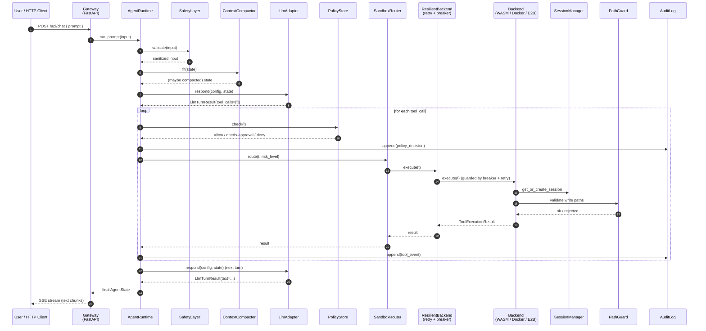
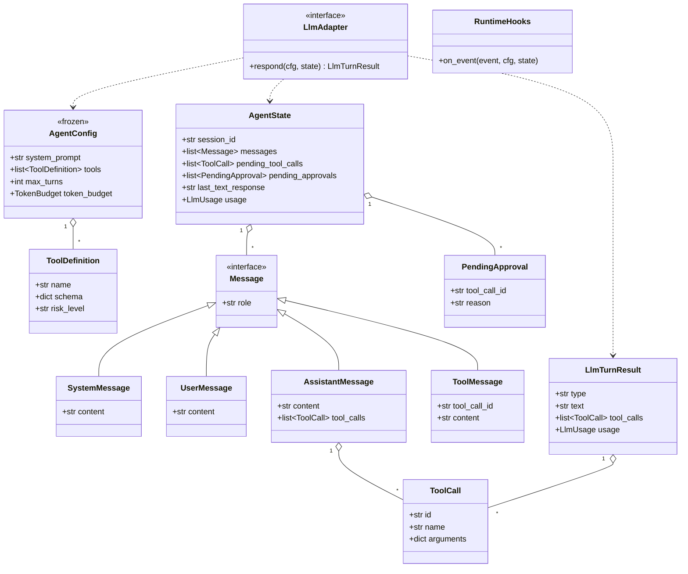

# TitanX

TitanX is a Python Agent SDK for building autonomous agents with explicit runtime semantics, multi-layer safety, policy controls, context compaction, and sandboxed tool execution.

This repository now tracks the Python implementation. The previous TypeScript implementation is kept next to it as `../TitanX-ts/` for reference.

## Quick Start

```bash
python -m venv .venv
source .venv/bin/activate
pip install -e ".[dev]"
python demo.py
```

## Gateway Demo

```bash
python run_gateway.py
```

The gateway starts on `http://localhost:3000`.

## Project Layout

| Path | Purpose |
| --- | --- |
| `titanx/runtime.py` | Main agent runtime loop |
| `titanx/types.py` | Core dataclasses and adapter interfaces |
| `titanx/factory.py` | Default runtime wiring |
| `titanx/safety/` | Input validation, redaction, and safety checks |
| `titanx/sandbox/` | Tool runtime, router, path guard, and backend interfaces |
| `titanx/resilience/` | Retry and circuit breaker support |
| `titanx/context/` | Token tracking and compaction |
| `titanx/policy/` | Policy store, audit log, and break-glass controls |
| `titanx/storage/` | Storage backend interfaces and implementations |
| `titanx/retrieval/` | Hybrid retrieval and MMR ranking |
| `titanx/tools/` | Optional tool catalogs, including IronClaw-inspired WASM tools |
| `titanx/gateway/` | FastAPI gateway and UI serving |

## Architecture

### 1. Layered Module View

```
╔══════════════════════════════════════════════════════════════════════════════╗
║                            CLIENT / ENTRYPOINT                                ║
║                                                                               ║
║   demo.py          run_gateway.py (FastAPI)          custom scripts           ║
║      │                    │                                │                  ║
║      └────────────────────┴────────────┬───────────────────┘                  ║
╚═══════════════════════════════════════ │ ═════════════════════════════════════╝
                                         ▼
╔══════════════════════════════════════════════════════════════════════════════╗
║                          GATEWAY (titanx/gateway/)                            ║
║                                                                               ║
║   server.py  (FastAPI app)                                                    ║
║     ├─ routes/chat.py    POST /api/chat    (SSE stream)                       ║
║     ├─ routes/memory.py  GET/POST /api/memory                                 ║
║     ├─ routes/jobs.py    GET /api/jobs                                        ║
║     └─ routes/logs.py    GET /api/logs                                        ║
║   Static UI served from ../ui/                                                ║
╚═══════════════════════════════════════ │ ═════════════════════════════════════╝
                                         ▼
╔══════════════════════════════════════════════════════════════════════════════╗
║                     FACTORY  (titanx/factory.py)                              ║
║            create_sandboxed_runtime(CreateSandboxedRuntimeOptions)            ║
║                   Wires all components, returns AgentRuntime                  ║
╚═══════════════════════════════════════ │ ═════════════════════════════════════╝
                                         ▼
╔══════════════════════════════════════════════════════════════════════════════╗
║                    CORE RUNTIME  (titanx/runtime.py)                          ║
║                                                                               ║
║          AgentRuntime.run_prompt(user_input)                                  ║
║                  │                                                            ║
║                  ▼                                                            ║
║   ┌──────────────────────────────────────────────────────────────────┐       ║
║   │  Loop (signal: continue | stop | interrupt)                      │       ║
║   │                                                                  │       ║
║   │    1. SafetyLayer.validate(input)    ─► injection / PII / paths  │       ║
║   │    2. ContextCompactor.fit(state)    ─► compact if over budget   │       ║
║   │    3. LlmAdapter.respond(cfg, state) ─► user-supplied LLM        │       ║
║   │    4. if tool_calls:                                             │       ║
║   │         ├─ PolicyStore.check()       ─► approve / break-glass    │       ║
║   │         ├─ SandboxRouter.execute()   ─► route to backend         │       ║
║   │         └─ AuditLog.append()         ─► JSONL append             │       ║
║   │    5. Append result to AgentState, decide next signal            │       ║
║   └──────────────────────────────────────────────────────────────────┘       ║
║                                                                               ║
║   State model:  AgentConfig (frozen=True)  +  AgentState (mutable)            ║
║   types.py:     Message / ToolCall / LlmAdapter / RuntimeHooks / ...          ║
╚═══════════════════════════════════════ │ ═════════════════════════════════════╝
                                         ▼
┌─────────────────┬────────────────┬─────────────────┬──────────────┬──────────────┐
│   SAFETY        │   CONTEXT      │   POLICY        │   RETRIEVAL  │   STORAGE    │
│ (safety/)       │ (context/)     │ (policy/)       │ (retrieval/) │ (storage/)   │
├─────────────────┼────────────────┼─────────────────┼──────────────┼──────────────┤
│ safety_layer    │ compactor      │ policy_store    │ hybrid       │ pg_vector    │
│ validator       │   summarize    │   snapshots +   │   vec + FTS  │   asyncpg    │
│ redactor        │   PTL fallback │   rollback      │ mmr          │ libsql       │
│ patterns        │ types          │ break_glass     │ types        │   Turso/SQLite│
│  (injection /   │   TokenBudget  │ audit_log(JSONL)│ EmbeddingProv│  StorageBackend│
│   PII / path)   │                │ types           │              │                │
└─────────────────┴────────────────┴─────────────────┴──────────────┴──────────────┘

╔══════════════════════════════════════════════════════════════════════════════╗
║                     SANDBOX LAYER  (titanx/sandbox/)                          ║
║                                                                               ║
║   SandboxedToolRuntime (tool_runtime.py)                                      ║
║     ├─ PathGuard          write-path allow-list + shell redirect scan         ║
║     ├─ SessionManager     per-session lifecycle                               ║
║     └─ SandboxRouter  ──► selects backend by risk_level                       ║
║                                                                               ║
║              ┌──────────────────────┴──────────────────────┐                  ║
║              ▼                                             ▼                  ║
║   ┌─────────────────────┐                     ┌──────────────────────┐       ║
║   │  ResilientBackend   │ ◄── wraps each ──►  │   SandboxBackend     │       ║
║   │  (resilience/)      │     real backend    │   (interface)        │       ║
║   │    ├ CircuitBreaker │                     └──────────┬───────────┘       ║
║   │    │   closed→open→ │                                │                    ║
║   │    │   half-open    │       ┌────────────────────────┼──────────────────┐ ║
║   │    ├ retry          │       ▼                        ▼                  ▼ ║
║   │    │   expo+jitter  │   ┌────────┐              ┌────────┐         ┌──────┐║
║   │    └ _is_retryable  │   │ WASM   │  low-risk    │ Docker │ medium  │ E2B  │║
║   │                     │   │wasmtime│              │aiodocker│        │remote│║
║   └─────────────────────┘   └────────┘              └────────┘         └──────┘║
║                                   ▲                                            ║
║                                   │                                            ║
║                            tools/ironclaw_wasm.py                              ║
║                     (optional IronClaw WASI tool catalog,                      ║
║                        ABI: titanx-wasi-json-argv)                             ║
╚═══════════════════════════════════════════════════════════════════════════════╝
```

### 2. Request Sequence (one user turn with a tool call)



### 3. Core Data Model



### 4. Trust Boundaries & Threat Model

```
 Untrusted ─────────────────────────────────────────────────────────► Trusted

┌──────────┐   ┌─────────────────────────────────┐   ┌────────────────────────┐
│  User    │   │         Host Process            │   │   Isolated Sandbox     │
│  Input   │   │   (your Python service)         │   │   (WASM / Docker /E2B)│
│          │   │                                 │   │                        │
│  prompt  │──►│  ┌──────────┐    ┌───────────┐ │──►│  ┌──────────────────┐ │
│  file    │   │  │ Safety   │──► │ Runtime   │ │   │  │ Tool process /   │ │
│  args    │   │  │ Layer    │    │ Loop      │ │   │  │ wasmtime /       │ │
│          │   │  └──────────┘    └─────┬─────┘ │   │  │ container / e2b  │ │
└──────────┘   │       ▲                │       │   │  └──────────────────┘ │
               │       │                ▼       │   │          ▲             │
  ║ BOUNDARY 1 │       │         ┌──────────┐   │   │          │             │
  ║  all input │       │         │ LLM API  │   │   │          │  BOUNDARY 3 │
  ║  redacted, │       │         │ (remote) │   │   │          │  sandbox    │
  ║  injection │       │         └──────────┘   │   │          │  escape     │
  ║  patterns  │       │                ║       │   │          │  prevention │
  ║  blocked   │       │   BOUNDARY 2   ║       │   │          │             │
               │       │   LLM output   ║       │   │          │             │
               │       │   is untrusted ║       │   │          │             │
               │       │   → safety re- ║       │   │          │             │
               │       │   applied      ║       │   │          │             │
               │       │                ▼       │   │          │             │
               │  ┌──────────┐    ┌───────────┐ │   │          │             │
               │  │ Policy   │◄──►│ Sandbox   │ │   │          │             │
               │  │ Store    │    │ Router    │─┼───┘          │             │
               │  └─────┬────┘    └─────┬─────┘ │              │             │
               │        │               │       │              │             │
               │        ▼               ▼       │              │             │
               │  ┌──────────┐    ┌───────────┐ │              │             │
               │  │AuditLog  │    │PathGuard  │─┼──────────────┘             │
               │  │(JSONL)   │    │           │ │                            │
               │  └──────────┘    └───────────┘ │                            │
               └─────────────────────────────────┘                            │
                                                                              │
  Boundary legend:                                                            │
   1. User → Host:   SafetyLayer validates/redacts (injection, PII, paths)    │
   2. LLM → Host:    LLM output treated as untrusted; re-checked by Safety    │
                     + PolicyStore gates tool calls (approval / break-glass)  │
   3. Host → Sandbox: PathGuard vets write paths; SandboxRouter picks         │
                     isolation tier by risk_level; ResilientBackend wraps     │
                     calls with retry + circuit breaker                       │
```

Trust escalates left-to-right; every boundary crossing is mediated by a guard component. Audit events are appended to JSONL at every policy decision and every tool invocation.

## IronClaw WASM Tool Catalog

TitanX includes an optional catalog of IronClaw-inspired WASM tools: `github`,
`gmail`, `google_calendar`, `google_docs`, `google_drive`, `google_sheets`,
`google_slides`, `slack`, `telegram_mtproto`, `web_search`, `llm_context`, and
`composio`.

Enable the catalog when constructing the runtime:

```python
from titanx import CreateSandboxedRuntimeOptions, create_sandboxed_runtime
from titanx.sandbox import WasmCommandRegistration

runtime = create_sandboxed_runtime(CreateSandboxedRuntimeOptions(
    llm=llm,
    safety=safety,
    enable_ironclaw_wasm_tools=True,
    wasm_commands={
        # Each command should point to a TitanX-compatible WASI wrapper.
        "web_search_tool": WasmCommandRegistration(module_path="./wasm/web_search_tool.wasm"),
        "github_tool": WasmCommandRegistration(module_path="./wasm/github_tool.wasm"),
    },
))
```

The ABI for these handlers is `titanx-wasi-json-argv`: TitanX executes a
registered WASI command and passes one JSON argument:

```json
{"tool":"web_search","action":"search","params":{"query":"TitanX"}}
```

This intentionally does not assume IronClaw's component-model/WIT ABI. To run
the actual tools, compile or wrap them as TitanX-compatible WASI commands that
read `argv[1]` and write their result to stdout.

## Minimal LLM Adapter

```python
from titanx import AgentConfig, AgentState, LlmAdapter, LlmTurnResult


class EchoLlm(LlmAdapter):
    async def respond(self, config: AgentConfig, state: AgentState) -> LlmTurnResult:
        last = next((m for m in reversed(state.messages) if m.role == "user"), None)
        return LlmTurnResult(type="text", text=f"Echo: {last.content}" if last else "Hello")
```

Pass your adapter into `create_sandboxed_runtime()` to run TitanX with any LLM provider.
