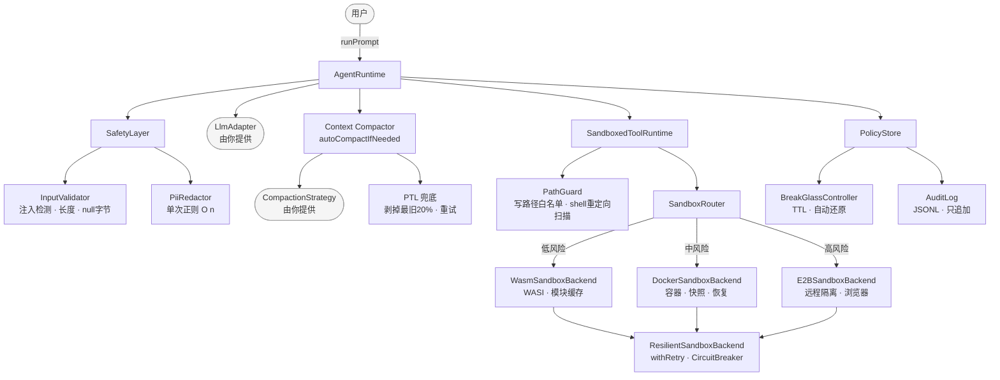
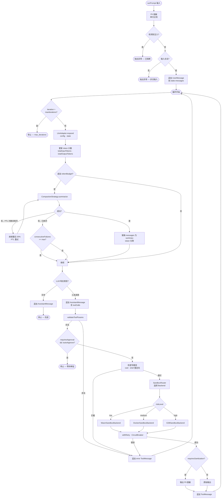

# TitanX

[English](./README.md) | **中文**

具备显式运行时语义、多层安全防护与沙箱工具执行能力的 TypeScript Agent SDK。不依赖 LangGraph —— 循环、状态与安全边界均为纯代码实现。

---

## 架构总览



---

## 模块说明

### `src/types.ts` — 核心类型

`AgentConfig` 持有只读的会话参数（threadId、systemPrompt、availableTools 等）。`AgentState` 持有可变的运行时状态（messages、iteration、tokens、signals）。两者严格分离，确保循环内部无法意外覆写配置字段。

### `src/runtime.ts` — `AgentRuntime`

主循环：

```
while signal !== "stop":
  1. 调用 LLM → 文本或工具调用
  2. 追踪 token 消耗
  3. 按需触发上下文压缩
  4. 若为文本 → 停止
  5. 若为工具调用 → 校验 → 审批检查 → 执行 → 追加结果
```

构造函数：

```ts
new AgentRuntime(llm, tools, safety, configInput, hooks?, policyStore?, compactionStrategy?, compactionOptions?)
```

### `src/sandbox/` — 三层沙箱

| Backend | 风险等级 | 适用场景 |
|---------|---------|---------|
| `WasmSandboxBackend` | 低 | 仅执行已注册的 WASI 命令；内存 + 磁盘模块缓存 |
| `DockerSandboxBackend` | 中 | 文件系统工作负载；`docker commit` 快照与恢复 |
| `E2BSandboxBackend` | 高 | 远程浏览器隔离 |

`SandboxRouter` 根据工具处理器的 `policy` 字段选择 Backend。`SandboxedToolRuntime` 通过 `extractShellWriteTargets()` 强制执行文件写入白名单，并扫描 shell 重定向目标（`>`、`>>`、`tee`）。

**目录隔离** — 传入 `directories: { logs, cache, workspace }` 将各关注点分置于独立子树。

**文件写入白名单** — 传入 `allowedWritePaths: ["/workspace/out"]` 将所有写操作（包括 shell 重定向）限制在显式路径内。

### `src/policy/` — 策略管理

```ts
const store = new PolicyStore({ maxIterations: 20, autoApproveTools: false });

// 受控变更，附带审计记录
store.set({ autoApproveTools: true }, "reason");

// 快照 + 回滚
const snap = store.snapshot();
store.rollback(snap.id);
```

**Break-glass** — 限时紧急权限放松，由宿主触发，TTL 到期后自动还原：

```ts
const bg = new BreakGlassController(store, auditLog);
bg.activate("incident", 60_000, { ...relaxedPolicy });
// 60 秒后自动回滚
```

所有变更（policy_change、break_glass_activated、break_glass_expired、rollback）均写入只追加的 JSONL 审计日志。

### `src/safety/` — 多层安全校验

- **注入检测** — 10 种模式（忽略指令、越狱 token、提示词覆盖、角色扮演升级等）；阻断级别
- **PII 脱敏** — 8 种模式（邮箱、电话、SSN、信用卡、IP、API Key、JWT、密码）；构造时合并为单一正则，O(n) 性能
- **路径逃逸阻断** — 6 类场景（`../`、null 字节、绝对路径覆盖、`%2F`、双重编码、Windows `..\\`）

```ts
const safety = new SafetyLayer();
const result = safety.checkInput(userText); // 先脱敏 PII，再检测注入
```

### `src/resilience/` — 熔断器 + 重试

**`CircuitBreaker`** — 三态（closed → open → half-open），滚动失败窗口：

```ts
const cb = new CircuitBreaker("docker", { failureThreshold: 5, successThreshold: 2, cooldownMs: 60_000, windowMs: 60_000 });
await cb.call(() => backend.execute(req));
```

**`withRetry`** — 指数退避 + jitter + `retryIf` 过滤器：

```ts
await withRetry(() => backend.execute(req), { maxAttempts: 3, baseDelayMs: 100, maxDelayMs: 10_000, jitter: true });
```

**`ResilientSandboxBackend`** — 将任意 `SandboxBackend` 包裹在重试与熔断器中，所有方法通过 `breaker.call(() => withRetry(...))` 委托。

### `src/context/` — 上下文压缩

在每轮 LLM 调用后，当 `totalInputTokens >= tokenBudget` 或 `state.needsCompaction` 被设置时触发。

```
尝试 summarize(messages)
  → 失败：剥掉最旧 20%（PTL），最多重试 maxPtlRetries 次
  → 重试耗尽：consecutiveFailures + 1
  → consecutiveFailures >= maxConsecutiveFailures：熔断，跳过后续压缩
成功：messages 替换为 [system…] + [summary]，token 计数归零
```

提供一个调用你的 LLM 的 `CompactionStrategy`：

```ts
const strategy: CompactionStrategy = {
  async summarize(messages) {
    return myLlm.summarize(messages);
  },
};
```

---

## 请求生命周期



单次 `runPrompt()` 调用经历以下阶段：

**1. 安全入口**
- `SafetyLayer.checkInput()` 执行 PII 脱敏（单次合并正则，O(n)），然后进行注入检测
- `InputValidator` 拒绝空内容、超长输入和 null 字节
- 任何注入模式命中均立即抛出 —— 请求不进入主循环

**2. 消息入队**
- 经过脱敏的内容封装为 `UserMessage` 追加到 `state.messages`

**3. 主循环（每轮重复）**

**3a. 迭代上限检查**
- `iteration > effectiveMaxIterations` → signal = stop
- `effectiveMaxIterations` 优先读取 `PolicyStore`，fallback 到 `AgentConfig`

**3b. LLM 调用**
- `LlmAdapter.respond(config, state)` 返回文本或工具调用
- 从 usage 元数据更新 `state.totalInputTokens` 和 `totalOutputTokens`

**3c. 上下文压缩（可选）**
- `totalInputTokens >= tokenBudget` 或 `state.needsCompaction` 时触发
- 调用 `CompactionStrategy.summarize(messages)`
- 失败时：剥掉最旧 20% 的消息（PTL），最多重试 `maxPtlRetries` 次
- 连续失败达 `maxConsecutiveFailures` 次：熔断开启，本会话后续跳过压缩
- 成功：`messages` 替换为 `[system…] + [summary]`，token 计数归零

**3d. 文本响应**
- 追加 `AssistantMessage` → signal = stop → 循环结束

**3e. 工具调用路径**
- **参数校验** — `validateToolParams()` 失败时追加 error `ToolMessage` 并跳过执行
- **审批检查** — `requiresApproval && !autoApproveTools` 挂起循环，宿主调用 `approvePendingTool()` 后恢复
- **写路径检查** — `isPathAllowed(cwd)` 和 `extractShellWriteTargets()` 扫描 shell 重定向目标，对照白名单校验
- **Backend 路由**（`SandboxRouter`）：
  - `riskLevel: low` → `WasmSandboxBackend`（WASI 沙箱，仅允许已注册命令）
  - `riskLevel: medium` → `DockerSandboxBackend`（容器隔离，支持快照/恢复）
  - `riskLevel: high` → `E2BSandboxBackend`（远程隔离，支持浏览器）
- **弹性保障**（启用 `ResilientSandboxBackend` 时）：`withRetry` 执行指数退避（`baseDelay * 2^attempt` + jitter）；`CircuitBreaker` 在滚动窗口内追踪失败，达阈值后开启熔断
- **输出脱敏** — `requiresSanitization` 将输出路由至 `sanitizeToolOutput()` 进行 PII 脱敏
- 追加 `ToolMessage` → 回到 3a

**横切关注点**

| 位置 | 机制 |
|------|------|
| 入口 | 注入检测 + PII 脱敏 |
| 每轮迭代 | token 计数 + 压缩触发 |
| 工具执行前 | 参数校验 + 审批门控 + 写路径白名单 |
| Backend 调用 | 指数退避重试 + 三态熔断器 |
| 工具输出 | PII 脱敏 |
| 全程 | `PolicyStore` 动态控制 `maxIterations`、`autoApproveTools`、`allowedWritePaths`；`BreakGlassController` 提供限时权限放松；`AuditLog` 记录所有策略变更 |

---

## Factory 工厂方法

`createSandboxedRuntime` 将所有组件串联起来：

```ts
import { createSandboxedRuntime } from "./src/factory.js";

const runtime = createSandboxedRuntime({
  llm,
  safety,
  config: { maxIterations: 12, autoApproveTools: false },
  wasmCommands: {
    hello: { modulePath: "/path/to/hello.wasm" },
  },
  directories: { logs: "/var/log/agent", cache: "/var/cache/agent", workspace: "/workspace" },
  allowedWritePaths: ["/workspace"],
  policyStore: store,
  compactionStrategy: strategy,
  compactionOptions: { tokenBudget: 150_000 },
  resilientOptions: { failureThreshold: 5, successThreshold: 2, cooldownMs: 60_000, windowMs: 60_000 },
});

await runtime.runPrompt("执行演示");
```

---

## 快速上手（最简配置）

```ts
import { AgentRuntime } from "./src/runtime.js";
import { SafetyLayer } from "./src/safety/safety-layer.js";
import type { LlmAdapter, ToolRuntime } from "./src/types.js";

const llm: LlmAdapter = {
  async respond(_config, state) {
    const last = state.messages.at(-1);
    if (last?.role === "tool") return { type: "text", text: "完成。" };
    return { type: "tool_calls", toolCalls: [{ id: "c1", name: "echo", args: { text: "你好" } }] };
  },
};

const tools: ToolRuntime = {
  listTools: () => [{ name: "echo", description: "回显文本", parameters: {} }],
  execute: async (_name, params) => ({ output: String(params.text ?? "") }),
};

const runtime = new AgentRuntime(llm, tools, new SafetyLayer(), { maxIterations: 4, autoApproveTools: true });
await runtime.runPrompt("打个招呼");
```

---

## 测试套件

```bash
npm run build
node --test test/safety.test.mjs       # 32 个测试：注入、PII、路径逃逸、校验器
node --test test/resilience.test.mjs   # 18 个测试：熔断器、重试、弹性 Backend
node --test test/context.test.mjs      # 11 个测试：压缩触发、PTL、熔断器
node --test test/policy.test.mjs       # 16 个测试：PolicyStore、AuditLog、BreakGlass
node --test test/session-manager.test.mjs
node --test test/router.test.mjs
node --test test/wasm-backend.test.mjs
node --test test/docker-backend.test.mjs
node --test test/e2b-backend.test.mjs
node --test test/tool-runtime.test.mjs
```

---

## WASI 示例

```bash
wat2wasm examples/hello.wat -o examples/hello.wasm
```

```ts
import { createDemoRuntime } from "./src/demo.js";
const runtime = createDemoRuntime("/path/to/hello.wasm");
await runtime.runPrompt("运行演示");
```
