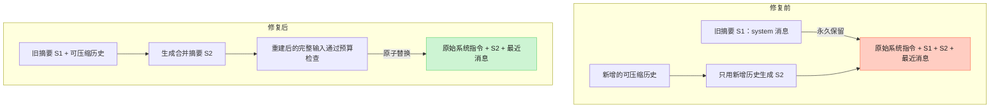
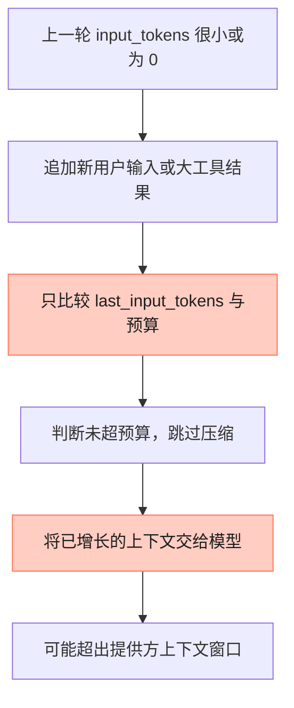
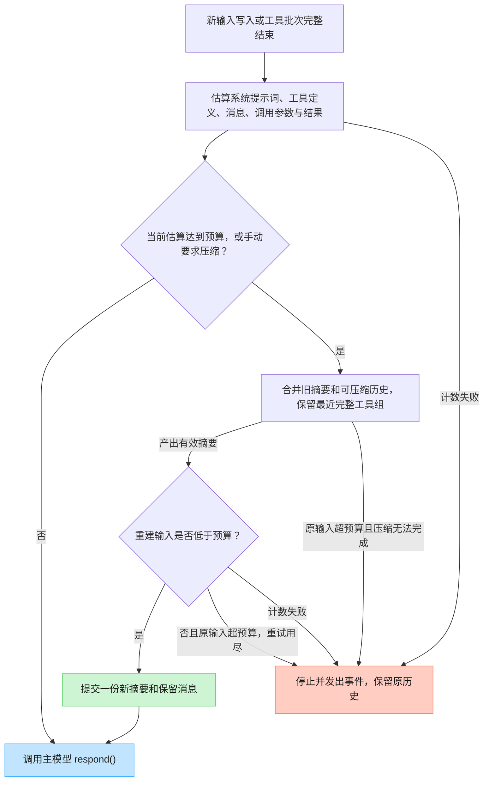

# 上下文压缩：旧摘要累积与当前输入漏检

记录日期：2026-09-07。范围：Python 主项目的 `AgentRuntime` 与 `titanx/context/`。
对应本次审查中的问题 2、问题 3，合并修复并记录。

后续更新（2026-09-08）：归档、工具结果转存、回查、任务状态和结构化摘要已实现。
本文保留当时的故障复现；当前接入方式、恢复 API 和升级前后图见
[context-management.md](context-management.md)。

## 问题与结果

| 问题 | 修复前 | 修复后 |
| --- | --- | --- |
| 2：旧摘要不断累积 | 生成的摘要是 system 消息，每次都永久保留，且不进入下一次摘要输入 | 旧摘要和可压缩历史一起合并，成功后只保留一份新摘要；原始系统指令保留 |
| 3：当前输入未检查 | 使用上一轮 `last_input_tokens`，遗漏新用户输入、模型输出和工具结果 | 每次主模型调用前估算当前完整输入，压缩后再次检查；仍不满足预算就停止 |

启用条件已放宽为只需配置 `compaction_options`；若未同时提供
`compaction_strategy`，运行时会自动创建 `LlmCompactionStrategy`（`runtime.py`）。
未启用压缩的运行时仍不会被强行添加预算，也没有更换宿主的模型或摘要策略。

## 问题 2：完整触发过程

1. 同一个运行时持续积累多轮对话，启用摘要策略。
2. 达到旧的预算触发条件，或者宿主设置 `state.needs_compaction = True`。
3. 第一次压缩将旧消息转成带有 `[Conversation summary so far]` 前缀的
   `SystemMessage`，例如摘要 S1。
4. 对话继续，随后第二次压缩。旧 `_split_pinned_tail()` 排除所有 system
   消息，因此 S1 不进入摘要策略；旧 `_system_messages()` 又原样保留 S1。
5. 新摘要 S2 被追加到 S1 后面。以后每次重复这个过程。

旧结构随压缩次数变化：

```text
第一次：原始系统指令 + S1           + 最近消息
第二次：原始系统指令 + S1 + S2      + 最近消息
第三次：原始系统指令 + S1 + S2 + S3 + 最近消息
```

`max_summary_chars` 只约束单次产出的长度，无法限制所有旧摘要的总量。
因此压缩次数增多时，永久保留的前缀仍会增长；过时的摘要也不能在后续合并中
被更新。它不要求摘要策略报错，也不依赖并发、工具或真实模型服务。

### 修复前后：摘要流向



新生成摘要设置 `SystemMessage.is_summary=True`。为合并旧格式已经累积的
摘要，`is_summary=None`（默认值）且使用上述完整保留前缀的 system 消息
也会被识别为历史摘要。若宿主自己写的系统指令恰好使用这个前缀，应显式
设置 `is_summary=False`，这样它会作为原始系统指令保留。

摘要继续使用现有的 system 角色，以维持适配器兼容性。`is_summary` 是 SDK
内部标记，适配器应只发送模型 API 接受的字段。摘要来源于对话内容，这个
角色及标记本身不保证摘要内容可信；本次修复不改变摘要的信任模型。

## 问题 3：完整触发过程

典型路径是“上一轮很小，刚返回的工具内容很大”：

1. 旧历史和当前请求能正常送入模型，模型返回工具调用，报告
   `usage.input_tokens = 10`。
2. 工具执行完成，把较长输出追加为 `ToolMessage`。此时
   `last_input_tokens` 仍是 10；这是上一轮的实际用量，不包含这条新结果。
3. 下一次循环已经位于 `respond()` 之前，但旧 `_should_compact()` 只比较
   `10 >= token_budget`。预算较大时，该条件不成立，摘要策略完全不会调用。
4. 模型收到增长后的上下文；真实提供方可能因超出窗口拒绝请求。
5. 如果提供方拒绝而没有返回新 usage，就不能依靠这次调用刷新计数后再补救。

另外两种入口有相同问题：首次 `run_prompt()` 的 `last_input_tokens` 是 0；
不返回 usage 的适配器会使它保持或重置为 0。新用户输入、系统提示词和工具
定义的大小也不能通过上一轮 usage 完整反映。

### 修复前：检查的是过去，发送的是现在



### 修复后：先检查当前输入，再决定是否发送



图展示正常压缩与超预算阻断路径。若**原输入已经低于预算**，只是手动要求的
压缩失败，则允许保留原输入继续调用，直到连续失败达到配置上限。
达到上限后同样停止。若不可裁剪部分本身已达到预算，直接停止，不浪费摘要调用。

## 修复实现及边界

1. **当前输入计数。** 新增 `context/tokens.py`，默认将模型可见 JSON 内容的
   UTF-8 字节长度作为保守 token 估算。包含 `config.system_prompt`、工具名称、
   描述和参数 schema，以及所有消息内容、工具调用 ID/名称/参数、工具结果。
   不计入消息 UUID、审批状态和累计计费用量。
2. **适配器计数接口。** `CompactionOptions.token_estimator(config, messages)`
   可替换为宿主模型的实际计数器。同步返回非负整数；异常、负数、布尔值或
   非整数都按计数失败停止，不能静默绕过。单独调用压缩函数时，可通过关键字
   `config=` 传入配置；省略时计数器收到 `None`，无法计入未提供的配置。
3. **压缩后复查。** 同时检查摘要字符上限和重建输入的预算。只有最终估算
   **不超过** `target_tokens` 才提交新消息列表（未配置 `target_token_budget`
   时等于 `input_budget - 1`）；输入达到 `token_budget` 就触发压缩。
   字符上限不能替代 token 检查，例如中文摘要可能字符数不多但估算较大。
4. **失败保持现场。** 原输入超预算时，即使连续失败尚未达到上限，也不会
   调用主模型。摘要失败、仍超预算或计数失败都保留原消息列表；摘要和计数
   回调收到隔离副本。取消仍向上传播，不提交半成品。
5. **工具协议完整。** 最近消息按 `min_recent_messages` 保留，边界向前扩展
   至工具声明的起点。PTL 第一次移除最大的历史组，之后移除最旧的一部分组；
   一个 assistant 工具声明及其连续的所有结果始终一起处理。旧摘要每次重试
   都进入策略输入，不作为 PTL 丢弃对象。PTL 仍可能损失较旧的非保留历史。
6. **用量不混用。** `last_input_tokens` 保留最近一次提供方实际报告；压缩不再
   将它清零。`total_input_tokens`、`total_output_tokens` 继续累计，均不参与触发。

默认估算倾向于提前压缩，**不是所有模型的精确 token 数或绝对上界**。适配器
可能增加额外消息、工具封装或不同的请求格式。应将 `token_budget` 设置为扣除
输出额度和安全余量后的可用输入预算；需要更准确判断时接入模型专用计数器。
预算检查针对主运行时的 `LlmAdapter.respond()`；摘要策略若自行调用另一个
模型，仍需要管理其请求格式、窗口和超时。

```python
from titanx.context import CompactionOptions

options = CompactionOptions(
    token_budget=32_000,  # 可用输入预算，已为输出和额外封装留余量
    min_recent_messages=6,
    max_summary_chars=16_000,
)

# 若宿主已实现同步计数函数，可传入：
# options = CompactionOptions(32_000, token_estimator=count_adapter_input)
# count_adapter_input(config, messages) 必须覆盖实际适配器发送的完整输入。
```

## 宿主可观察的行为

| 情况 | 事件与结果 |
| --- | --- |
| 成功压缩且重建输入低于预算 | `compaction_triggered`，继续主模型调用 |
| 原输入超预算，压缩失败或无法缩小 | `compaction_failed`、`compaction_blocked`，以 `context_budget_exceeded` 结束本次循环 |
| 计数器出错或返回无效数值 | `compaction_failed`、`compaction_blocked`，以 `token_estimation_failed` 结束 |
| 手动压缩失败但原输入低于预算，未达到失败上限 | `compaction_failed`，继续使用原输入 |
| 失败次数已到上限 | `compaction_exhausted`；本次同时发生预算或计数阻断时，优先报告对应的具体阻断原因 |

`compaction_blocked` 包含 `reason`、`estimated_input_tokens`、`token_budget`。
第一次计数就失败时，估算字段为 `None`。停止使用 `state.signal="stop"` 和
相应的 `LoopEndEvent.reason`，宿主应展示该原因，不能把它当成正常回答完成。

若最新工具结果本身就超过预算，本次修复不会默默截断它，也不会无条件重跑
工具。宿主可以调整工具为分页/分块输出、采用受控缩减的历史，或在模型实际
容量允许时调整预算，再调用 `resume()`。仅原样重试不会缩小上下文；达到
连续失败上限后，应由宿主修正配置或策略并重建运行时，而不能自动无限重试。

## 本地复现与验证证据

先添加最初 4 个回归用例，再修改实现。在旧实现上的真实结果是 **4 failed**：

| 用例 | 输入与关键设置 | 旧实现实际结果 | 修复后结果 |
| --- | --- | --- | --- |
| 重复压缩 | 原始 system；每轮追加 4 条 user；保留最近 2 条；手动压缩 | 第二次已有 2 份摘要，单摘要断言失败 | 连续 3 轮各只有 1 份摘要，上一份进入下一次策略输入 |
| 首次大输入 | `"request " * 300`；预算 1000 | 模型被调用一次 | 模型调用 0 次，保留输入并报告预算阻断 |
| 新工具结果，可通过压缩容纳 | 旧文本 `"history " * 150`；工具结果 `"data " * 200`；上一轮 input_tokens=10；预算 2500；保留 2 条 | 摘要调用 0 次 | 第二次模型调用前摘要调用 1 次；两次发送的输入估算均低于预算 |
| 无 usage 的大工具结果 | 工具结果 `"data " * 1000`；预算 2500 | 模型调用 2 次 | 只有首轮模型调用；工具声明与结果完整保留，随后预算阻断 |

回归文件：[test_context_compaction.py](../tests/test_context_compaction.py)。共 38 个用例，
另外覆盖旧格式迁移、系统提示词/工具 schema/调用参数计数、摘要失败回滚、
压缩后仍超预算、计数器错误、中文计数、PTL 工具组完整性、取消、零条保留配置、
usage 不重置，以及批准后 `resume()` 的工具结果预算检查。

运行命令（在 Python 项目根目录）：

```bash
.venv/bin/python -m pytest -q tests/test_context_compaction.py tests/test_runtime_prompt_admission.py tests/test_runtime_lifecycle.py tests/test_runtime_cancellation_protocol.py tests/test_gateway_chat.py tests/test_gateway_hardening.py --tb=short
.venv/bin/python -m compileall -q titanx demo.py run_gateway.py
.venv/bin/python demo.py
git diff --check
```

相关测试结果：**86 passed**。`compileall` 和 `git diff --check` 均通过；demo
正常输出 `Final response: Echo: Hello, TitanX!`。
测试使用本地模型、工具和摘要替身，真实运行主循环与压缩模块；没有调用真实
模型、Docker 或 E2B，因此没有将模拟结果表述为真实提供方 HTTP 错误验证。

## 代码位置

- [compactor.py](../titanx/context/compactor.py)：摘要合并、工具分组、预算复查、失败回滚。
- [tokens.py](../titanx/context/tokens.py)：默认输入估算与计数接口。
- [context/types.py](../titanx/context/types.py)：压缩选项和配置校验。
- [runtime.py](../titanx/runtime.py)：每次主模型调用前预检与停止事件。
- [types.py](../titanx/types.py)：摘要标记、usage 语义和 `CompactionBlockedEvent`。
