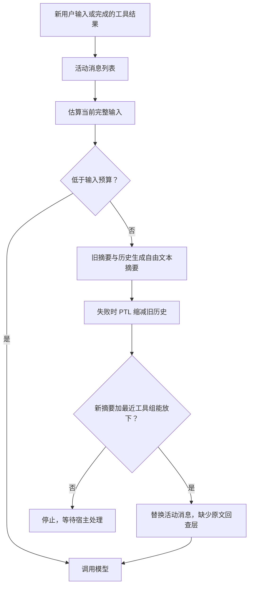
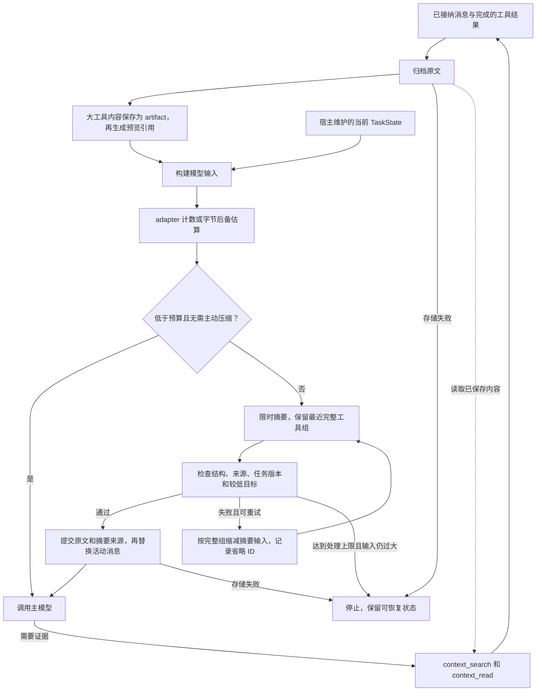
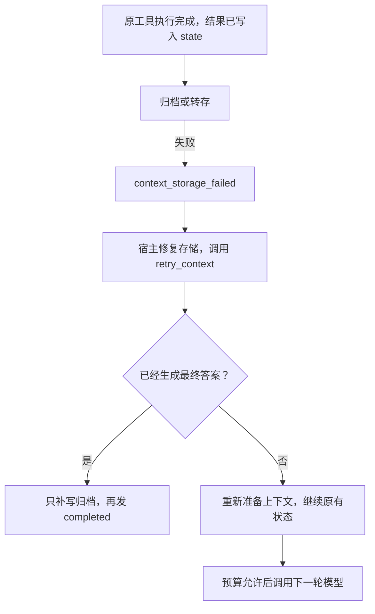

# 上下文管理升级：原文归档、任务状态与有界压缩

日期：2026-09-08。范围：Python 主项目。状态：已实现，按配置启用。

2026-09-15 入口更新：终端和网页统一使用 `run.py`，并默认启用本文功能；SDK 的
配置默认值不变。`python run.py --check-context` 运行上下文校验，旧脚本仅兼容转发。
下文 2026-09-08 的演示数字是历史结果，当前默认配置及验证见[统一入口](unified-entrypoint.md)。

本文记录调研后前三项改进的触发条件、实现、恢复行为和验证结果。基础压缩缺陷的
修复前复现保留在 [context-compaction.md](context-compaction.md)，方案来源和框架对比
见 [调研报告](context-runtime-comparison-2026-09-08.md)。本次保留显式 Python 主循环与
`LlmAdapter` 接口，不增加第三方 agent runtime 依赖。

## 1. 改了什么

| 改进 | 之前的限制 | 当前行为 |
| --- | --- | --- |
| 原文归档 | 压缩替换 `state.messages` 后，SDK 没有可回查的原文层 | SQLite 会话归档保留已接纳消息；摘要替换前提交原文、摘要及来源记录 |
| 大工具输出 | 最近工具组必须保留，单条大结果可能导致一直无法发送下一轮 | 安全处理后的大结果先转存，再以预览和内容引用参与模型输入 |
| 回查 | 摘要漏掉精确值后只能靠剩余上下文 | `context_search` 定位消息，`context_read` 分页读原消息 JSON 或工具内容，不执行原工具 |
| 当前任务 | 目标和约束只在普通历史消息中，可能被摘要遗漏 | `TaskState` 独立保存目标、约束、验收条件与版本；每次构建输入都带上当前版本 |
| 摘要结构 | 任意非空短文本都可能被接受 | 内置策略要求结构化 JSON、输入来源 ID、当前任务版本；字段、引用或版本不符则拒绝替换 |
| 输入预算 | 字节估算，压缩到触发线下方一点即可 | 支持 adapter 计数接口、窗口/输出/余量分离、独立较低的压缩目标 |
| 失败处理 | 自定义摘要可能一直等待；缺少可用的上下文重试入口 | 每次摘要和存储调用有超时；明确事件与 `retry_context()`，完成的工具不会被框架重放 |
| 可观测性 | 主要知道压缩成功或失败 | 记录前后大小、目标、耗时、摘要 usage、来源和 PTL 省略 ID、失败分类 |

默认不自动创建数据库。已有 `compaction_strategy + compaction_options` 调用仍有效。
需要归档与回查时传入 `ContextOptions(store=...)`；同时配置压缩选项但没有自定义策略时，
SDK 使用 `LlmCompactionStrategy(llm)`。只配置 ContextOptions 也能归档、转存和回查，
但不会自动建立模型预算限制。

## 2. 完整触发过程

### 场景 A：大工具输出卡在最近保留区

1. 模型请求读取日志，工具完成并返回很长的结果。
2. 主循环先完成工具结果的既有安全处理，写入 `ToolMessage`，推进并清空已完成批次。
3. 旧机制的最近工具组不可拆分；如果该组本身超过输入预算，压缩旧历史也无法解决，
   运行时以 `context_budget_exceeded` 停止。这一停止是预算保护，并非熔断问题。
4. 新机制在下一次模型调用前，先归档原消息；超过 `offload_threshold_chars` 的工具内容
   通过 `put_artifact()` 保存，得到内容 ID。
5. 保存成功后，用预览、字符总数、`context_read` 参数替换活动消息内容，保留原消息 ID、
   工具名和 tool call ID。若引用比原文还长，则不替换。
6. 模型需要末尾精确值时，提交 `context_read(kind="artifact", id=..., offset=..., limit=...)`。
   原工具已经执行完毕，此处只读存储。

可运行示例 `demo_context.py` 的实测输出：工具结果 **44,017 → 418 字符**，
分页读回 `EXACT_RESULT=9182`，经过三次压缩后仍能检索原文，原始工具执行次数为 **1**。
该结果使用确定性模型替身验证执行路径，不是对真实模型的准确率测量。

### 场景 B：早期约束消失，或者旧要求覆盖新要求

1. 早期用户提出目标和限制，之后积累很多观察及工具结果。
2. 压缩生成一段很短但不含关键限制的摘要；旧检查只看长度、非空及预算，因此可能通过。
3. 新机制由宿主调用 `runtime.set_task()` 保存当前目标、限制和验收条件。未显式设置时，
   启用 ContextOptions 默认把第一个通过安全检查的用户输入捕获为目标。
4. 每次模型输入都插入当前任务版本。这个头部不写入活动 `state.messages`，也不参与 PTL 丢弃。
5. 用户改变要求时，宿主显式 `set_task()`，任务 ID 保持不变、revision 递增；`new_task=True`
   才建立新 ID。参数代表完整的新版本，未传入的旧 constraints 不会自动继承。
6. 内置摘要必须引用当前 task ID/revision，不能修改 TaskState、工具批次或审批集合。

新用户消息**不会自动判断哪些旧约束已撤销**。宿主必须在任务变更时更新 TaskState；
否则当前任务头会继续表达旧要求。`capture_task=False` 可关闭首次自动捕获。
任务内容过大也会占用预算，不会被框架静默裁掉。

### 场景 C：反复触线、摘要挂起或保存失败

1. 模型输入达到触发预算，或者宿主设置 `state.needs_compaction=True`。
2. 先保留原始 system 指令和最近完整工具组，再合并上一份摘要与可压缩历史。
3. 摘要调用受 `summary_timeout_seconds` 限制。格式有效后重建输入，再按当前模型格式计数。
4. 重建输入必须达到独立的 `target_token_budget`，再提交原文/摘要/来源记录；提交成功才替换
   活动消息。超时、校验失败或存储失败不会把一个未确认的摘要写入活动上下文。
5. PTL 重试先丢弃估算最大的旧消息组，之后每次丢弃最旧的 20% 组，至少一组；旧摘要和最近
   完整工具组保留。被省略的旧消息 ID 进入 `omitted_message_ids`，原文仍在会话归档中。
6. 超预算且无法压缩时停止。宿主修复存储或调整运行配置后调用 `retry_context()`。
   若只是最终答案的归档失败，重试只补写归档和完成事件，不再调用模型。

一次压缩最多调用摘要 `max_ptl_retries + 1` 次，可能因候选历史已空而提前结束。
超时是合作式 asyncio 取消：同步阻塞的自定义 adapter/store 或吞掉取消的实现无法靠
`wait_for` 强制终止，需要宿主遵守异步接口约定。

## 3. 前后流程图

下图“升级前”指基础压缩缺陷已经修复、但本次管理能力尚未接入时的版本。
更早的旧摘要累积和漏检问题，见原修复报告的前后图。







## 4. 接入示例

以下 `llm` 是应用现有 LlmAdapter，`my-session-id` 必须由宿主按已验证身份绑定；
示例目录需由宿主提前创建。数据库在应用生命周期内复用，并在退出时 `await store.close()`。

```python
from titanx import (
    CompactionOptions, ContextOptions, CreateSandboxedRuntimeOptions,
    LlmCompactionStrategy, SQLiteContextStore, SafetyLayer,
    create_sandboxed_runtime,
)

store = SQLiteContextStore("./data/context.sqlite")
runtime = create_sandboxed_runtime(CreateSandboxedRuntimeOptions(
    llm=llm,
    safety=SafetyLayer(),
    context_options=ContextOptions(
        store=store,
        session_id="my-session-id",
        offload_threshold_chars=12000,
        preview_chars=800,
        read_max_chars=4000,
        storage_timeout_seconds=10,
    ),
    compaction_strategy=LlmCompactionStrategy(llm, max_output_tokens=2048),
    compaction_options=CompactionOptions(
        token_budget=24000,
        model_context_window=32000,
        reserved_output_tokens=4000,
        safety_margin_tokens=2000,
        target_token_budget=14000,
        min_recent_messages=6,
        summary_timeout_seconds=30,
        max_ptl_retries=2,
        require_structured_summary=True,
    ),
))
runtime.set_task(
    "审查上下文模块并给出修复",
    constraints=("保持现有公共调用兼容",),
    acceptance_criteria=("问题记录包含触发步骤和回归证据",),
)
state = await runtime.run_prompt("开始检查")
```

这里有效输入预算为 `min(24000, 32000 - 4000 - 2000) = 24000`，压缩目标为 14000。
这些数值只是接入示例，需按实际模型窗口和工作负载设置。

计数优先级：显式 `CompactionOptions.token_estimator` → adapter 的
`count_input_tokens(config, messages)` → 序列化 UTF-8 字节估算。接口是同步函数，返回
非负整数；返回 `None` 才进入后备估算，异常或非法值会停止发送。
计数包含当前任务头、系统提示、工具定义、工具参数和工具结果。默认字节估算不是
真实 token 数，也不是所有提供方封装的严格上界。

adapter 应使用与 `respond()` 相同的消息序列化格式和 tokenizer 实现计数，并把
`config.max_output_tokens` 转发到提供方的输出限制参数。SDK 无法替一个任意自定义
adapter 强制实现提供方计数或输出上限。`reserved_output_tokens` 用于主模型；
摘要策略的 `max_output_tokens` 单独配置。未设置 `model_context_window` 时，
`token_budget` 已被视为可用输入预算，不会再减一次输出预留。

## 5. 数据、来源与回查契约

- `state.messages` 是当前活动历史；发送模型时临时加入当前任务头。一个新的摘要成功后
  只保留一份摘要，前代摘要 ID 保存在新摘要来源里，形成可追溯链。
- SQLite `messages` 按 `(session, message_id)` 首次写入后不覆盖。转存后的短视图无法
  用相同 ID 覆盖已保存原文；原文指运行时已经接纳、安全处理后的内容，而非未清洗的外部输出。
- `artifacts` 保存完整工具内容，以 SHA-256 派生的 ID 引用；同样按会话隔离。
- `compactions` 保存摘要结果、前后大小、usage、直接来源、PTL 省略 ID 和任务版本。
  省略 ID 表示未进入最终那次摘要输入，不表示磁盘原文已删除。
- `tasks` 保存当前任务；实际参与归档的任务版本还作为不可覆盖消息保存。
  同一进程内连续调用多次 set_task 而没有执行/归档，不会自动记录每个中间版本。
- `context_search` 是对归档消息 JSON 的字面子串搜索，不是向量检索。结果包含
  `message_id`、JSON 字符偏移、240 字符预览和游标。`after` 取上次结果最后一项的 cursor。
- `context_read` 的 `offset`/`limit` 按 Unicode 字符计算，不按字节或 token；消息读到的是
  JSON，artifact 读到的是已保存工具内容。用 `next_offset` 继续，值为 null 表示结束。
  Runtime 会把单页限制在 `read_max_chars`；JSON 封装额外开销仍参与下一轮预算检查。
- 回查工具没有模型可选择的 session 参数，也不接受文件路径。其调用继续经过现有策略、
  审计和结果安全处理；可以被工具 denylist 拒绝，不享有绕过审批或策略的特殊权限。
- 回查返回值不会再次转存，避免“引用的内容还是引用”的循环。多次回查仍可能占满最近
  保留区，此时需要减小页长或增大可用预算，不能保证任意内容都能容纳。

SQLite 写入是事务性的；摘要替换前等待归档提交。新建数据库文件采用 0600 权限，
已有文件权限由宿主管理。宿主可用 `delete_session()` 删除会话数据；当前没有自动 TTL、
存储配额、加密或跨会话共享机制。

## 6. 失败与恢复约定

| 事件或原因 | 行为与处理 |
| --- | --- |
| `context_offloaded` | 内容保存并替换为引用后发出，含前后字符数与 ID |
| `compaction_triggered` | 摘要提交成功；含前后计数、目标、耗时、usage、来源和省略 ID |
| `compaction_failed` | 一轮压缩未成功；细分为 timeout、invalid、target_not_reached、pinned_context_too_large 等 |
| `context_budget_exceeded` | 当前输入超预算且无法压缩；不调用主模型 |
| `token_estimation_failed` | 不能可靠取得配置要求的计数；不绕过检查 |
| `context_storage_failed` | 归档、内容转存或压缩提交失败；不会用未保存引用替换原内容 |
| `compaction_exhausted` | 达到连续失败上限；宿主处理后显式恢复 |

失败停止会通过 `loop_end.reason` 暴露；`compaction_blocked` 提供相应上下文。
预算内的主动压缩如果失败，仍可继续主模型调用，直到失败次数达到上限；原有行为保持。
摘要 usage 来自提供方报告，成功结果和内置策略的格式校验失败均可记录。超时、连接中断
且没有 usage 回包时，SDK 无法知道服务端实际消耗，事件中的 0 不证明没有计费。
主模型既有 usage 计数不被摘要调用改写；计算总成本时需要同时汇总摘要事件。

修复上下文问题后调用 `await runtime.retry_context()`，而不是直接 `resume()`：
普通 resume 仅运行 `signal == "continue"` 的状态。retry_context 重置本次迭代和压缩
失败计数，但不撤销策略、不添加审批，也不会把已清空的工具队列重新执行。
等待审批的批次仍需先处理审批。最终文本已生成而只有最终归档失败时，只补存储，
完成事件必须在归档成功后才发出。

SQLite 通过线程执行事务；取消异步等待时，已启动的线程可能仍完成整个事务。
这不会提交半批数据，也不会自动修改内存视图；重新归档是幂等的。
同一 runtime 的 run_prompt、resume、set_task、retry_context 仍须由宿主串行调用。

## 7. 验证与边界

新增测试见 [test_context_management.py](../tests/test_context_management.py)，与基础压缩
测试合计 **74 项通过**。整个当前 Python 工作区：**425 passed，1 skipped**。
这些结果验证当前工作区，也包含先前修复，并不表示这些用例全由本次新增。
跳过项是缺少 `tests/fixtures/component_read_file.wasm` 的 sidecar component smoke 测试。

| 场景 | 已验证行为 |
| --- | --- |
| 三次连续压缩 | 仅一份活动摘要、来源链连通、当前约束仍存在、早期精确值仍可查 |
| 用户修订目标 | 同 ID 版本递增，当前任务头不继承被撤销限制；等待审批时禁止更换任务 |
| 大工具结果 | 转存后模型分页回查，原始工具只执行一次；工具消息组完整 |
| 原文持久化 | 关闭并重开 SQLite 后可读取；旧 ID 不被短视图覆盖；中文和 NUL 分页可还原 |
| 摘要伪造字段或来源 | 拒绝不匹配版本、未知引用、额外授权字段、空摘要；状态和审批保持 |
| 存储失败/取消 | 引用和摘要在提交成功前不替换；恢复不重放工具；最终归档重试不重复调用模型 |
| 限时和计数 | 摘要超时取消；adapter 计数与显式估算优先级正确；目标低于触发线；输出预留参与配置 |
| 会话和策略 | 跨会话读取被拒绝；页长受限；回查工具仍受 denylist 和安全处理控制 |

```bash
.venv/bin/python -m pytest -q tests/test_context_management.py tests/test_context_compaction.py --tb=short
.venv/bin/python -m pytest -q --tb=short
.venv/bin/python -m compileall -q titanx demo.py demo_context.py run_gateway.py
.venv/bin/python demo.py
.venv/bin/python demo_context.py
git diff --check
```

结构和来源检查只能确认数据格式、引用范围和任务版本，**不能证明摘要每句话都正确，
也不能保证模型遵守了所有语义约束**。本次测试使用可控 adapter/工具/故障注入，不包含
真实提供方的长期任务成功率、摘要语义准确率或费用基准。这些需要应用选定模型后评测。

本次是上下文归档与同进程恢复：支持重开数据库查原文和 `load_task()`，但没有实现
跨进程执行检查点、自动重建完整 AgentState、恢复未完成工具游标或审批授权。
原文保存也不是每个工具副作用发生时的事务日志；突然杀进程可能发生在工具执行后、
下一次归档前。模型仍可能主动提出新的重复工具调用，框架的“不重放”不等于业务全局
exactly-once。提供方意外报 context overflow 时，本次也未添加自动重试适配。

## 8. 代码入口

| 文件 | 责任 |
| --- | --- |
| [runtime.py](../titanx/runtime.py) | 上下文预处理、任务设置、内置回查派发、结束归档、显式恢复 |
| [context/manager.py](../titanx/context/manager.py) | 配置、先保存再转存、受限回查工具 |
| [context/store.py](../titanx/context/store.py) | 会话原文、artifact、任务、压缩来源和 SQLite 事务 |
| [context/tasks.py](../titanx/context/tasks.py) | 构建含当前任务的模型视图 |
| [context/summary.py](../titanx/context/summary.py) | 结构化摘要模型请求与校验 |
| [context/compactor.py](../titanx/context/compactor.py) | 分组、限时重试、目标复查、归档成功后提交 |
| [context/types.py](../titanx/context/types.py) | 窗口、输入触发点、压缩目标、输出与余量配置 |
| [run.py](../run.py) | 统一入口，`--check-context` 运行离线上下文演示；旧 `demo_context.py` 兼容转发 |
