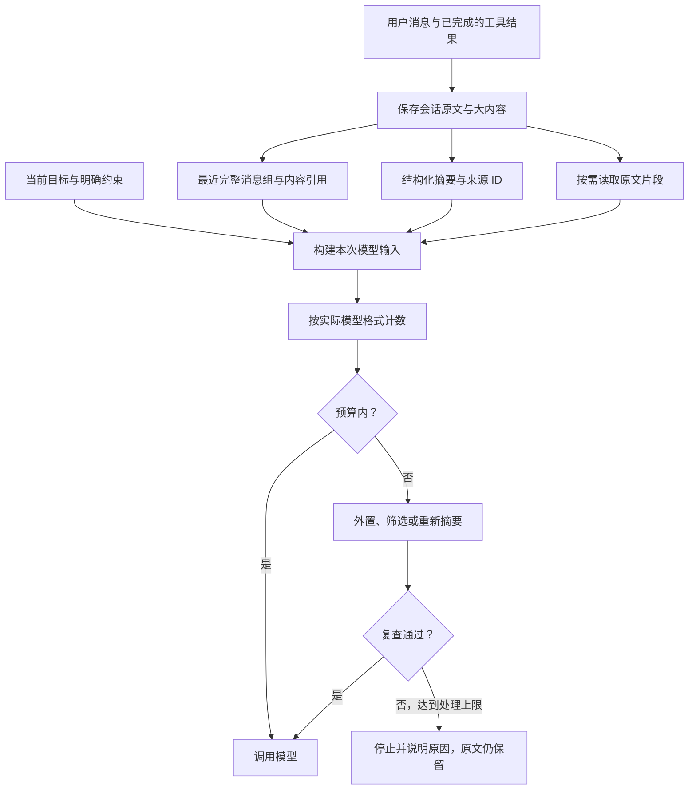

# TitanX 上下文机制评估与 Agent Runtime 对照

调研日期：2026-09-08。对象：当前 Python TitanX，以及 OpenAI Agents SDK / Responses、
Claude Agent SDK、LangGraph / Deep Agents、Google ADK、OpenHands SDK 的官方资料。

本报告区分官方文档描述、TitanX 代码事实和建议方案。没有运行这些框架的真实模型
横向基准，没有据此宣称任何框架的准确率、成本或延迟优于另一框架。在线文档会变化，
示例和参数不能跨 Python、TypeScript 或不同版本直接套用。本轮只增加调研文档。

## 判断

TitanX 的设计方向合理，已有可解释、可测试的压缩基础；面向长时间、多工具任务，
上下文管理仍不完整。当前最明显的差距是：缺少与压缩联动的原文保存和回查、大输出
外置、任务约束保护，以及真实摘要质量评测。

此前修复的“单份滚动摘要、当前请求预检、压缩后复查、工具调用成组保留、失败不覆盖
历史”应继续保留。它们解决运行边界问题，但不能证明摘要忠实、长期任务能持续推进。

## 当前代码确认了什么

| 能力 | TitanX 当前实现 | 评价 |
| --- | --- | --- |
| 触发 | 每次主模型调用前估算当前输入；也支持手动标记 | 正确，比只看上一轮 usage 更符合当前请求 |
| 覆盖范围 | 系统提示词、工具定义、消息、调用参数、工具结果 | 合理；提供方额外封装仍需适配器补齐 |
| 计数 | 默认用 JSON 的 UTF-8 字节数估算，可注入计数器 | 可作保守后备，不能当精确 token 数或通用上界 |
| 保留 | 原始 system 消息；最近至少 6 条非 system 消息；完整工具组 | 协议边界有保护；不保证最近用户请求或关键任务约束原文被保留 |
| 摘要 | 旧摘要与可压缩历史一起合并，最终只有一份新摘要 | 避免摘要累积，但反复摘要可能产生遗漏或失真 |
| 校验 | 非空字符串、字符上限、重建输入估算低于预算 | 没有语义完整性、来源覆盖或任务状态校验 |
| 回退 | 摘要失败时移除最大的旧消息组，再移除最旧的一部分组 | 可以缩小输入，但大小、时间先后不等同于信息价值 |
| 大输出 | 最近必须保留的内容自身超预算时停止 | 可靠的阻断措施，但缺少继续完成任务的内容缩减路径 |
| 保存 | 成功后直接替换 `state.messages` | 此路径未自动归档被替换原文，也未建立可回查的内容引用 |
| 集成 | 策略和选项都配置才启用；策略接口没有内置具体摘要实现 | SDK 可保持可选，但还需要可直接使用的参考实现 |
| 等待 | 直接 `await strategy.summarize(...)` | 压缩器自身没有每次摘要调用的超时设置，依赖宿主策略 |

主要依据：[compactor.py](../titanx/context/compactor.py)、
[tokens.py](../titanx/context/tokens.py)、[压缩配置](../titanx/context/types.py)、
[runtime.py](../titanx/runtime.py)。已有 [storage/types.py](../titanx/storage/types.py)
和 [memory 路由](../titanx/gateway/routes/memory.py) 提供存储/查询能力；在本次检查的
主循环和压缩路径中，没有发现自动串联“归档原文 → 压缩 → 按需回查”的流程。
不能因为模块存在就把这条链路视为已经完成。

## 五组官方实现的可借鉴设计

| 实现 | 本次核实的机制 | 对 TitanX 的启发 |
| --- | --- | --- |
| OpenAI Agents SDK | 官方 Cookbook 展示自定义 Session：按完整用户轮次保留最近历史，或将之前的轮次生成结构化摘要。这里是示例策略，不是 SDK 默认替所有应用开启的能力。[官方示例](https://developers.openai.com/cookbook/examples/agents_sdk/session_memory) | 保留边界应理解用户轮次，摘要需要专门评测 |
| Claude Agent SDK | 自动压缩及压缩边界事件；可配置摘要保留要求，通过 `PreCompact` 做归档；持久规则可通过配置的项目指令反复注入。[官方 Agent Loop](https://code.claude.com/docs/en/agent-sdk/agent-loop) | 将稳定约束与会被压缩的历史分开；暴露压缩生命周期 |
| LangGraph / Deep Agents | LangGraph 用 checkpointer 保存线程状态、Store 保存跨线程数据；Deep Agents 在其上提供工具内容外置、历史摘要和文件回查。[持久化](https://docs.langchain.com/oss/python/langgraph/persistence)、[上下文管理](https://docs.langchain.com/oss/python/deepagents/context-engineering) | 保存完整事实，按当前需要构建较小的模型输入 |
| Google ADK | 官方文档区分 token 触发和按轮次滑动窗口，并提供最近事件保留、重叠窗口及可替换摘要器。[官方压缩文档](https://adk.dev/context/compaction/) | 明确触发指标、保留规则和摘要器职责，避免混用“消息数”和“token 数” |
| OpenHands SDK | Condenser 返回压缩事件；事件记录保存被替换事件的 ID，再由 View 构建模型所见历史，并支持多阶段压缩。[官方架构](https://docs.openhands.dev/sdk/arch/condenser) | 分开保存原始事件与模型输入视图，让压缩具有可追踪的来源 |

OpenAI 的另一条路线在 **Responses API 层**：支持配置阈值的服务端压缩，也支持
独立 compact 调用；结果可能包含不透明的压缩条目及保留项。它并非普通字符串摘要，
不宜直接塞入 TitanX 当前的 `summarize() -> str` 接口。可以作为提供方专用扩展，
而不是跨模型公共核心的唯一表示。[官方 Compaction](https://developers.openai.com/api/docs/guides/compaction)

Deep Agents 尤其值得参考“大内容先外置、模型按需读回”的处理：工具结果可以保存到
后端，活动上下文留下引用与预览；压缩历史也保留文本记录。具体保留比例和阈值依赖
模型配置，不建议把其示例数值当 TitanX 的最佳参数。[官方说明](https://docs.langchain.com/oss/python/deepagents/context-engineering)

OpenHands 的事件与 View 分离具有清晰的调试边界：原事件、压缩事件和最后呈现给模型
的视图是不同对象。采用这种思想并不要求把 TitanX 改写成图运行时。
[官方 Condenser 架构](https://docs.openhands.dev/sdk/arch/condenser)

各框架都存在取舍。官方 OpenAI 示例明确讨论裁剪导致遗忘、摘要导致失真，以及额外
模型成本。存在自动压缩功能不代表任务事实一定保留，也不等同于完整长期记忆。
[官方 Session 示例](https://developers.openai.com/cookbook/examples/agents_sdk/session_memory)

## 本地受控检查：短摘要也可能不合格

为了验证“当前是否检查任务目标保留”，在独立内存状态中运行仓库压缩器：

- 第一条 user 消息要求仅审查实现，并在报告中保留 API 名称。
- 后面放入 8 条简短 assistant 消息，保留默认最近 6 条。
- 手动触发压缩，预算足够大。
- 测试摘要器只返回 `Earlier discussion completed.`，没有概括原目标。

实际结果：

```text
compaction_accepted: True
original_goal_retained_verbatim: False
summary: Earlier discussion completed.
retained_messages: 7
```

这说明“短、非空、预算合格”可以使没有保留目标的摘要通过校验。它不证明真实模型
每次都会漏目标，也不是实际任务准确率测量；它确认了当前保护边界不包含语义保真。
该实验没有执行工具、调用真实模型或修改运行时代码。

## 建议的演进顺序

### 第一阶段：让大输出和旧历史可回查

增加会话范围内的原文记录及内容存储接口。工具结果完成现有安全处理后，大内容保存
到后端，模型输入保留简短预览、稳定内容 ID 和读取方式；读取支持分页和搜索。
只有持久化成功才能用引用替换全文，回查也必须遵循相同会话的访问边界。

压缩前保存对应原文，记录新摘要覆盖哪些消息 ID。成功后可以替换活动上下文，但
不能同时失去历史来源。优先采用按 ID/范围读取和关键词搜索，不必先引入向量数据库。

验收场景：某次工具返回大日志，主模型仍能继续；后续问日志尾部的某项精确值时，能
按引用读回原文，且不会为了找回内容重新执行有副作用的工具。

### 第二阶段：固定当前任务约束，提供结构化摘要

增加明确的当前任务状态，例如目标、用户明确限制、验收标准、已完成事项、待办和
来源引用。用户更新目标时应明确更新这些字段，不能无限保留已撤销的旧目标。
关键约束应直接源自用户/配置，而不是只依赖摘要模型重新转述。

提供可选的内置摘要策略和固定输出结构。验证必要字段、引用存在性、任务 ID 与
状态一致性；用实际长任务评测语义保真。结构化输出只是更容易验证，并不自动保证真实。
摘要不能生成或改变审批授权；已有策略与审批记录仍是执行依据。

最近保留策略应结合用户轮次、完整工具组与 token 大小。不能简单保留整个当前用户
轮次：一个长任务内部可能产生很多工具轮次，整轮保留也会无限增长。

### 第三阶段：更准确计数，压缩后留足空间

让模型适配器对实际发送格式计数或提供估算；保留现有字节估算作为可见的后备策略。
明确区分模型窗口、输出预留、额外封装余量、触发点及压缩目标大小。

现在只要求压缩后略低于同一预算。建议压缩到更低的目标值，减少下一次小工具结果
就再次触发的情况。具体目标比例应按工作负载测量，暂不把任何百分比作为硬编码标准。

为摘要尝试设置超时，记录压缩耗时、调用成本、前后大小和失败原因。提供方报告上下文
超限时，可以做有上限的重新计数/压缩；不能为了恢复上下文重放已完成的工具副作用。

### 第四阶段：把运行恢复与上下文恢复分清

归档原文支持查证，运行检查点支持续跑，两者用途不同。若要跨进程恢复，还需要保存
当前状态、消息或内容引用、压缩版本、工具批次进度等；不能从摘要猜测工具是否执行
或是否获批。跨会话长期记忆也应是单独的应用能力。

LangGraph 的 checkpointer 与 Store 区分可作参考，但 TitanX 可继续使用明确的
Python 主循环和自己的接口。[官方持久化说明](https://docs.langchain.com/oss/python/langgraph/persistence)

## 建议架构图：调研时的方案

实施更新：前三阶段的归档/回查、任务状态/结构化摘要、计数接口/目标/超时与事件已落地。
接入方法、验证和实际边界见 [context-management.md](context-management.md)。下图保留
调研时的设计意图；跨进程执行恢复和提供方 overflow 自动重试仍未实现。



## 如何证明改进有效

现有压缩回归覆盖格式、计数、失败回滚、协议边界等；新增能力还应测真实任务结果：

| 评测场景 | 应检查的结果 |
| --- | --- |
| 早期用户约束，经过多次压缩 | 当前目标和限制是否仍被正确执行 |
| 多次纠正需求 | 新要求生效，旧要求不会被摘要重新带回 |
| 大工具输出含精确值 | 能定位原文取得值，而非根据摘要猜测 |
| 用户轮次包含很多工具调用 | 能缩减内容，同时保留必要上下文和完整调用组 |
| 摘要超时、存储失败 | 有界失败、原文保留、没有工具重放 |
| 超长对话恢复 | 原文查证、活动上下文重建、执行进度恢复各自正确 |

建议记录任务成功率、关键约束保留率、原文回查成功率、压缩频率、实际输入 token、
摘要额外 token 和耗时。以相同模型、工具数据与任务对比当前实现和候选方案，才能
判断新增复杂度是否带来实际收益。

近期优先实现第一、二阶段，并为摘要调用补上超时。保留当前失败停止与协议保护作为
最后边界。现有缺陷修复记录见 [context-compaction.md](context-compaction.md)。
