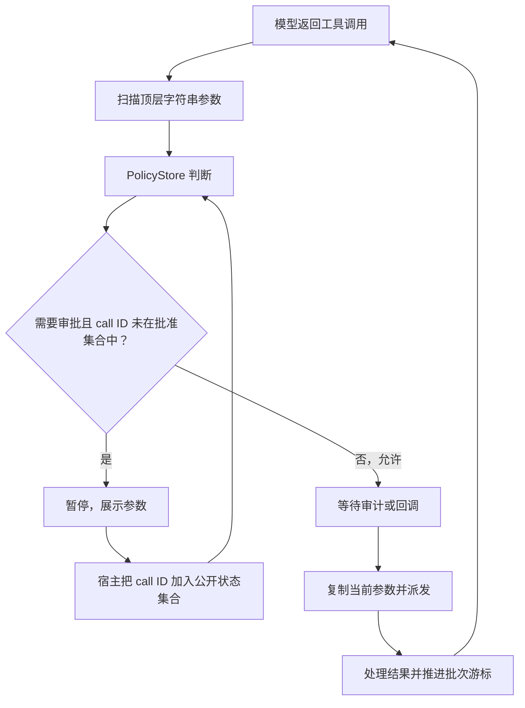
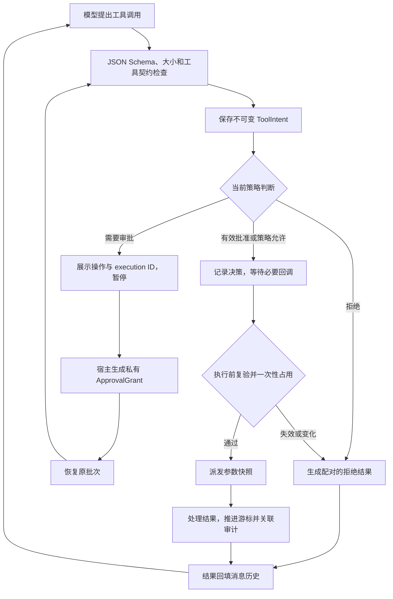

# Model-Tool Loop：操作绑定审批与执行前复验

日期：2026-09-10。状态：**第一期已实现**。
关联原则：TXS-01、TXS-03、TXS-05；同时加强 TXS-09 的运行实例准入。
范围：Python SDK 的同进程、同一 asyncio 事件循环，以及现有 HTTP / WebSocket 审批入口。

## 1. 问题与触发条件

原主循环有参数安全扫描、PolicyStore、审批暂停和工具批次游标。
审批放行主要依赖 `AgentState.approved_tool_call_ids`；该集合在一次 `run_prompt`
开始时清空，但在同次运行的后续模型轮次中继续存在。

因此，消息关联 ID 同时承担了授权依据，缺少独立操作身份与授权生命周期。
下列是根据修复前代码确定的触发条件；本次使用修复后的本地替身测试验证新契约，
没有对旧实现运行攻击流程，也没有访问外部目标。

| 场景 | 完整触发顺序 | 修复前缺少的边界 |
| --- | --- | --- |
| 同一次运行中复用 call ID | 第一批调用暂停 → 宿主批准并执行 → 下一轮模型再次返回相同 call ID → 进入策略判断 | 若仍是 `needs_approval`，旧批准集合可能让新操作直接通过；缺少批次、序号、工具和参数绑定 |
| 批准后等待过久 | 宿主批准 → 暂未恢复 → 稍后调用 `resume()` | 批准记录没有有效期 |
| 批准后策略修改或回滚 | 等待执行的调用已获批 → 宿主更新策略，或更新后回滚 → 恢复调用 | 批准未绑定单调策略版本。原代码仍检查当前 denylist；不是所有策略都被忽略 |
| 决策与派发之间发生变化 | 参数及策略检查通过 → 等待审计/宿主回调 → 回调期间策略或待执行数据变化 → 工具派发 | 派发前没有统一复验和一次性占用步骤 |
| 参数结构不满足契约 | 模型提供工具参数 → 顶层字符串扫描 → 进入工具执行 | 通用入口没有执行完整 JSON Schema 校验，不能保证嵌套类型、必填字段和结构限制 |
| SDK 调用方重叠恢复 | 宿主批准 → 一个 `resume()` 正在执行 → 同时调用另一个 `resume()` | 原来依赖宿主串行调用；SDK 本身没有拒绝重叠运行的入口保护 |

保护对象是“用户审阅的操作”“当前宿主策略”“一次有效派发”和工具消息协议。
单凭上述缺口不代表某个部署存在可被远程利用的路径；具体可达性取决于宿主接线。

## 2. 修复前流程



图中只展开允许/审批路径；原有拒绝路径仍存在。

## 3. 已实现的方案

### ToolIntent：不可变的操作描述

宿主生成独立的 `execution_id`、`run_id`、`batch_id`，并记录批次序号、模型 call ID、
工具名、工具契约摘要、参数摘要及策略 epoch。身份绑定来自当前宿主配置的
`thread_id / session_id / user_id / channel`。

参数与契约以有界的规范化 JSON 字符串保存，避免 frozen dataclass 内部仍包含可变字典。
执行参数从相同快照重新解析；宿主审批界面、事件副本及 handler 参数彼此分离。
call ID 继续用于消息配对，不作为授权凭证。

身份绑定不等于身份认证。本期没有新增租户认证、资源解析器或下游资源所有权校验。

### ApprovalGrant：宿主私有批准记录

批准保存于 ExecutionGuard 内，绑定完整 ToolIntent，并使用单调时钟计算有效期。
默认有效期为批准后 300 秒；状态包括 `approved / consumed / revoked`。
`AgentState.approved_tool_call_ids` 保留为兼容观察字段，写入该集合不再授予执行权限。

正常批准、拒绝和恢复 API 保留；新增可选 `execution_id` 参数用于宿主判断回复是否过时。
也可在准入前调用 `revoke_tool_approval(execution_id)` 撤销批准。
撤销不回滚已开始的外部动作，已准入的操作不能通过该接口撤销。

### ExecutionGuard：最终准入

每次工具执行都走同一个边界：

1. 验证 JSON 值、嵌套深度、节点数和字节数，再按注册 schema 验证参数。
2. 核对当前工具目录和配置视图与宿主保存的契约是否相同。
3. 使用当前 PolicyStore 决定允许、拒绝或需要审批。
4. 等待必要审计/回调之后，再核对操作、身份、契约、批准有效性和策略 epoch。
5. 在没有 `await` 的同步段内消费批准并占用该操作，随后派发快照参数。

PolicyStore 的成功 `set()` 和 `rollback()` 均递增 epoch，且在首次等待之前发布新版本；
失败的策略验证不改变 epoch。最终准入与策略更新在同一事件循环上串行发生。
这不是跨线程锁、数据库事务或跨进程执行账本。

JSON Schema 使用 `jsonschema` 支持的已知版本，未标版本时按 Draft 2020-12；
注册时检查 schema 本身。引用解析使用不带外部获取回调的 `Registry()`，不因 `$ref`
读取网络或文件；文档内引用可正常使用。`format` 仍是默认的注解语义，不能代替
路径、网络目标或业务资源授权。复杂 schema 的计算时间隔离不在本期范围内。

默认 JSON 上限为 1,000,000 字节、32 层、10,000 节点，用于参数和单工具契约。
自定义 Python 对象、非字符串键、非有限浮点数以及超限结构会被拒绝。
schema 中的 `additionalProperties` 语义保持不变；要禁止多余字段应在契约中显式声明。

### 暂停恢复与网关

同一 Runtime 的独立 `run_prompt()` / `resume()` 重叠调用会在修改状态前被拒绝。
现有网关在 `loop_end(pending_approval)` 回调中等待决定并同任务恢复的模式仍支持；
只对这个已暂停的回调开放同任务恢复，普通工具/事件回调不能重入执行。

HTTP 与 WebSocket 的 approve/reject 请求现在同时匹配 `toolCallId` 和 `executionId`。
浏览器页面保存审批事件中的标识、展示实际工具名及参数，再提交绑定的回复。
失败响应不会把审批横幅当成成功关闭。

## 4. 修复后流程



| 情况 | 现在的行为 |
| --- | --- |
| 参数、工具契约、身份或操作 ID 不匹配 | 拒绝该调用并补齐原调用的工具结果 |
| 恢复时批准过期、撤销或策略 epoch 变化 | 按当前策略重新判断；仍需审批时生成新的 execution ID 并再次暂停 |
| 审计等待后才发现授权失效 | 本次不派发，返回拒绝结果；不会在旧批准上继续执行 |
| 新批次复用旧 call ID | 产生独立操作，旧批准不能复用 |
| 相同操作重复准入 | 拒绝，不能重复消费批准 |
| 必需的目录获取或 schema 验证失败 | 拒绝，不降级为未经验证的派发 |

## 5. 使用与迁移

```python
from titanx import AgentRuntime, ExecutionGuardOptions

runtime = AgentRuntime(
    llm=llm,
    tools=tools,
    safety=safety,
    execution_guard_options=ExecutionGuardOptions(approval_ttl_seconds=300),
)
await runtime.run_prompt("修改这份笔记")
pending = runtime.state.pending_approval
if pending is not None:
    # 宿主展示 pending.tool_name 和 pending.parameters，取得批准后执行：
    runtime.approve_pending_tool(execution_id=pending.execution_id)
    await runtime.resume()
```

默认工厂的 `CreateSandboxedRuntimeOptions.execution_guard_options` 接受相同配置。

- **SDK**：旧的无参 `approve_pending_tool()` 仍表示宿主批准当前待审批项；UI/异步宿主
  应传递展示时取得的 execution ID。重复无参批准且没有待审批项时不改变运行状态。
- **网关协议变更**：approve/reject 消息必须回传当前审批事件的 `execution_id`
  （请求字段支持 `executionId` 或 `execution_id`），不能只传 call ID。
- **工具契约变更**：metadata 和参数必须可表示为有界 JSON；schema 会实际执行。
  依赖隐式类型转换或自定义 Python 参数对象的 handler 需要修改契约/适配器。
- **目录更新**：本期固定 Runtime 初始化时的契约，发现漂移则拒绝；有意更新工具时
  新建 Runtime 并重新审批，没有隐式热更新接口。
- **审计**：决策/调用事件新增 execution ID、运行/批次 ID、序号、策略 epoch 及批准状态；
  不把参数内容或参数摘要作为新审计字段。

## 6. 验证与剩余工作

新增 [test_execution_authorization.py](../tests/test_execution_authorization.py) 覆盖正常批准、
公开状态不授予权限、参数/身份/契约变化、旧 ID 复用、过期/撤销/策略回滚、最终复验、
嵌套 schema、有界 JSON、本地引用、外部引用拒绝、重复准入及并发恢复。
网关回归同时验证 HTTP / WebSocket 的绑定审批与流式续跑。

本次验证结果：新增授权测试 34 项通过；当前全量测试 **459 passed, 1 skipped**。
跳过项是缺少 `tests/fixtures/component_read_file.wasm` 的真实 WASM 组件测试。
最后追加的网关缺失/错误 execution ID 检查与授权测试合计 39 项通过。
Python 编译、`demo.py`、浏览器脚本语法和文档相对链接检查均通过。

主要命令：

```bash
.venv/bin/python -m pytest -q
.venv/bin/python -m compileall -q titanx demo.py run_gateway.py
```

尚未实现：P1 的操作/资源授权描述、实际网络出口统一强制及副作用感知重试；
P2 的租户身份认证、持久执行账本、执行前审计持久化确认和跨进程恢复。
本期的一次性准入只约束 Runtime 的派发，不承诺后端内部不重试或外部系统 exactly-once。

同进程 adapter、handler、hooks 和宿主 Python 代码仍处于受信任边界内；
私有属性与 frozen dataclass 不能隔离恶意宿主代码。用真实后端部署时仍需单独核验沙箱能力。

实现入口：[execution.py](../titanx/policy/execution.py)、[runtime.py](../titanx/runtime.py)、
[policy_store.py](../titanx/policy/policy_store.py)、[网关审批](../titanx/gateway/routes/chat.py)。
总体设计见 [Model-Tool Loop 安全设计](model-tool-loop-security-design.md)。

JSON Schema 行为参考官方文档：[参数验证](https://python-jsonschema.readthedocs.io/en/stable/validate/)、
[引用解析](https://python-jsonschema.readthedocs.io/en/stable/referencing/)。
