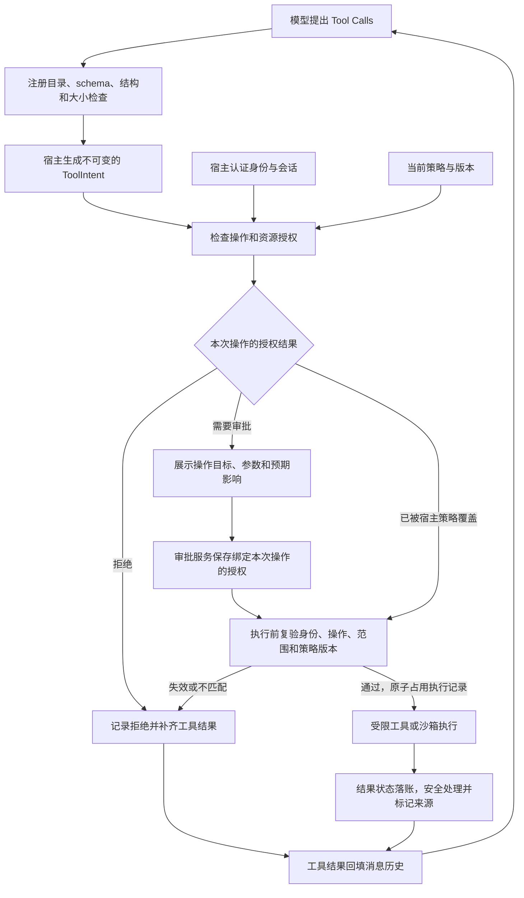
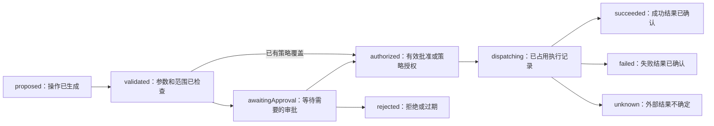

# Model-Tool Loop 安全设计

日期：2026-09-10。范围：TitanX Python SDK 的模型调用、工具审批、执行、结果回填与恢复。
状态：**分阶段设计，P0 的进程内操作绑定授权已实现**。ToolIntent、私有 ApprovalGrant、
ExecutionGuard、JSON Schema 校验和策略 epoch 已接入运行时；实现与验证见
[第一期修复记录](model-tool-loop-operation-authorization.md)。资源授权、持久化与副作用恢复
仍是后续设计，不能将整份目标方案描述为已完成。

本设计对应[安全原则目录](security-principles/README.md)中的项目基线；
采用 OWASP 2026 资料的范围与当前实现缺口分别记录在
[资料索引](security-principles/references/README.md)和[落地清单](security-principles/ADOPTION.md)。
下文保留的 OWASP 2025 引用仍按其原版本理解。

## 1. 设计目标

把安全边界放在“模型提出请求”与“宿主执行操作”之间：模型输出只能表达想做什么，
是否允许、允许访问哪些资源、如何执行，必须由模型之外的代码决定。

即使模型误解任务或受外部内容影响，也只能在宿主已授予的范围内行动。关键词扫描、
模型自检和提示词用于减少错误；最终权限限制由策略、资源授权和执行环境共同落实。
这与 OWASP 关于最小功能、最小权限、用户授权范围及逐次授权检查的建议一致。
[参考：OWASP Excessive Agency，2025 版](https://genai.owasp.org/llmrisk/llm062025-excessive-agency/)

本设计重点是工程边界的明确性，不主张发明一种新的 agent 架构，也不承诺消除所有
提示注入、模型错误或外部系统故障。

## 2. 当前已有能力及实际边界

| 能力 | 当前实现 | 本次设计要补的部分 |
| --- | --- | --- |
| 模型/工具分离 | 模型返回操作提案；ExecutionGuard 保存不可变 ToolIntent 和宿主操作标识 | 扩展业务资源描述及下游授权 |
| 工具准入 | `PolicyStore` 拒绝未知工具和 denylist 工具；按工具声明决定是否审批 | 工具可用之外，还要检查操作类型、目标资源、所属用户和授权范围 |
| 参数检查 | ExecutionGuard 验证 JSON Schema、嵌套结构和大小；保留原有安全扫描 | schema 不代替业务资源权限；复杂 schema 的时间隔离仍需扩展 |
| 审批暂停 | 私有批准绑定操作、参数、会话、契约、策略 epoch 和期限；恢复先处理原批次 | 跨进程批准服务、认证主体与资源授权集成 |
| 状态隔离 | 契约及参数保存为不可变 JSON；事件/派发得到副本；批准台账位于模型视图之外 | 不隔离恶意同进程插件代码；公共配置视图中的嵌套对象仍可变但不决定私有契约 |
| 沙箱执行 | 默认工厂接入沙箱路由，支持最低隔离要求及路径约束 | 统一操作所需能力与执行环境实际能力；任意自定义 ToolRuntime 不自动获得沙箱隔离 |
| 网络出口 | EgressGuard 支持按工具、目标、路径、方法限制及敏感内容检查 | 它是需要接入的检查接口；同进程代码的所有网络访问并非自动受它控制 |
| 工具输出 | 每次结果经过注入检查，按配置脱敏或包装为非可信数据 | 完整来源标记、数据流向规则、外发前权限检查；扫描通过不代表内容可信 |
| 审计 | 策略与工具事件集中进入 AuditLog | 当前 append/后台写入不等于执行前已持久化；强审计场景需要独立的持久化确认接口 |
| 上下文 | TaskState 独立、原文归档、摘要来源与分页回查 | 数据来源不构成权限来源；不能从旧摘要恢复批准记录 |
| 恢复 | 工具批次游标保护已完成步骤；取消时补齐调用结果 | 尚无跨进程执行检查点，也不能据此保证外部副作用 exactly-once |

以上是代码结构核对，不是漏洞可利用性结论，也没有执行攻击或漏洞复现。

代码入口：
[runtime.py](../titanx/runtime.py)、[types.py](../titanx/types.py)、
[policy_store.py](../titanx/policy/policy_store.py)、[validator.py](../titanx/safety/validator.py)、
[tool_runtime.py](../titanx/sandbox/tool_runtime.py)、[egress.py](../titanx/safety/egress.py)、
[audit_log.py](../titanx/policy/audit_log.py)。

## 3. 信任边界与保护对象

保护对象包括用户文件与私有数据、外部服务凭证、写入/删除/发送等操作权限、
审批决策、策略版本、执行进度和审计记录。

| 来源 | 如何使用 | 不赋予的权限 |
| --- | --- | --- |
| 宿主认证结果、受控配置和策略 | 身份及权限判定的依据 | 仍不能覆盖外部服务自身的授权规则 |
| 用户任务文字 | 表达目标，供模型规划 | 一段文字不能直接修改服务器权限或冒充审批接口 |
| 模型返回的工具名及参数 | 待验证的操作提案 | 不能声明自己已获批、选择身份或提高隔离权限 |
| 文件、网页、MCP 返回值、历史摘要 | 带来源的数据与证据 | 内容中的“已获授权”等说法不能改变批准台账 |
| 工具执行代码、adapter、宿主 hooks | 部署方信任的程序代码 | 未隔离的同进程插件不属于可以靠 Python 对象封装防御的对象 |

若要运行不信任的插件代码，应使用独立进程/沙箱及受限 IPC，而不是仅给它一个
“只读”Python 对象。多租户服务还需在网关把认证主体与会话、审批和归档绑定；
一个 session ID 或共享 API key 不能单独证明用户对该会话的所有权。
当前 gateway 支持 API key 和会话内串行执行，但不能据此宣称完整的多租户授权。

## 4. 目标执行流程

下图是**完整目标设计**。“操作封装”“绑定授权”“执行前复验”已完成进程内阶段；
业务资源范围、完整认证和可靠执行账本仍待补齐。当前实际流程见第一期修复记录。

每个步骤同时产生结构化事件。高影响操作如果要求可靠审计，应在执行前确认准备记录
已持久化；执行后记录失败时，不能通过重新执行工具来“补日志”。

## 5. 第一项核心设计：审批绑定具体操作

### 操作描述 ToolIntent

由宿主在验证模型输出后生成并冻结，建议包括：

本期字段使用宿主配置身份元组，并已实现运行/批次/序号、工具与参数摘要、策略 epoch。
下表中的独立 `principal_id / tenant_id` 及 `resource_scope` 是后续扩展目标。

| 字段 | 用途 |
| --- | --- |
| `execution_id` | 宿主生成的唯一操作 ID；模型提供的 call ID 仅用于消息关联 |
| `principal_id / tenant_id` | 来自宿主认证上下文，不能取自模型参数 |
| `session_id / run_id / batch_id / ordinal` | 绑定会话、本次运行及批次中的位置 |
| `tool_name / contract_digest` | 绑定工具目录中的具体契约，不能只匹配名称 |
| `arguments_digest` | 绑定规范化参数；执行使用同一份冻结参数 |
| `resource_scope` | 目标资源、操作类型及宿主允许的范围 |
| `policy_epoch` | 决策时的策略版本，策略变更及 rollback 都递增 |

参数规范化要拒绝不可表示的值，明确数字、字符串、嵌套结构和大小规则。
规范化不得悄悄改变待执行操作的意义。摘要值用于内部匹配，不将参数或其可猜测
摘要当成无害信息写入公开日志。

### 授权记录 ApprovalGrant

由审批服务保存：批准者、execution ID、完整绑定关系、有效期、批准范围和消费状态。
模型只需要知道“等待审批”“已执行”或“已拒绝”，不应获得可用于自行授权的凭证。
最初可以使用宿主内存中的不透明记录；跨进程使用时再接入带原子条件更新的存储。
单独计算一个 hash、将其放进模型消息，并不能构成授权系统。

规则：

1. 批准当前展示的操作，不能成为同名工具后续调用的通用通行证。
2. 工具契约、参数、资源、身份、会话或策略版本变化时，原批准不再覆盖该操作。
3. 拒绝、过期、消费、撤销均为显式状态；恢复不把这些状态重置为“已批准”。
4. 批准通过宿主 API 进入私有台账。`AgentState.approved_tool_call_ids` 可保留为兼容性
   观察字段，但不能作为新设计中授予权限的唯一依据。
5. 常规操作可以由宿主预先配置的窄范围策略直接覆盖；人类审批用于策略要求的高影响
   操作。不要求每次只读调用都重复确认。

示例：用户批准修改某一份报告时，审批界面展示目标文件和内容差异；授权覆盖该次
修改。后续修改另一份文件，或替换成另一段内容，应重新经过策略判定。
若文件内容在等待期间被其他人修改，可用版本号/ETag/内容基线校验避免覆盖未审阅内容。
文件访问的最终路径边界仍由后端在实际打开或写入时执行。

### 执行前复验与原子准入

在授予批准与实际执行之间可能发生策略调整、资源变化或会话失效。ExecutionGuard
应在最终派发边界复验，并将 `authorized → dispatching` 原子地提交。
批准消费、策略版本检查和执行记录占用必须有共同的串行化/事务约定，不能分散在
多个互不协调的检查中。

当前第一版通过同一 asyncio 事件循环上的无 await 同步段完成准入，并拒绝重叠 runner。
跨线程/进程版本需要额外的锁或事务约定，不能沿用这个串行性假设。
准入后已开始的操作不承诺被后来的撤销自动回滚；需要中止时，由后端取消能力决定。

## 6. 第二项核心设计：按动作与资源授予最小能力

工具是否注册只是第一层。授权还要判断“谁、对什么资源、做什么、允许到什么程度”。

| 操作 | 建议授权范围 | 最终执行边界 |
| --- | --- | --- |
| 读取项目文件 | 特定工作区、读取动作、内容大小 | 受限文件 API 或沙箱挂载 |
| 修改文件 | 特定目标、内容基线/差异、写入范围 | 后端文件访问权限及版本检查 |
| 查询业务数据 | 用户所属租户、允许表/接口、只读身份 | 数据库权限或服务端资源授权 |
| 调用外部 API | 工具身份、域名、路径、方法、凭证作用域 | 统一 HTTP 客户端加网络出口控制 |
| 高影响写入或发送 | 精确目标、动作、载荷与一次性批准 | 下游授权、幂等键或业务操作记录 |

建议新增宿主提供的 `ToolSecurityProfile`，声明操作类型、资源解析器、授权范围、
沙箱/网络能力、执行时限、数据量及副作用类别。模型不能通过自己的参数声明
“低风险”或“可直接执行”。风险判断来自宿主契约和确定性规则；模型可辅助说明，
不能替代最终判定。

资源解析器应把验证后的参数纯粹映射为执行描述，避免在授权完成前执行外部操作。
优先使用语义明确的窄工具；通用 shell 需要依靠整个进程的文件、网络和凭证限制，
不能把字符串扫描当成对任意命令效果的完整证明。

沙箱选择应满足声明的能力要求，必要环境不可用就拒绝。WASM、Docker、E2B 的名称
本身不能证明隔离强度，具体挂载、网络、凭证、宿主权限和后端实现都必须核对。
自定义 Python handler 只有接入相应执行器，才具有这些限制。

## 7. 第三项核心设计：回填数据不产生新权限

1. 工具结果带来源：工具身份、execution ID、消息 ID、内容引用及安全处理状态。
2. 外部文本、摘要和模型推断属于数据。它们不能直接调用批准接口、修改策略、
   为后续工具授予权限或选择凭证。
3. 保留现有注入扫描、可选 PII 脱敏和非可信内容包装。扫描漏检也不应导致确定性的
   权限检查被绕开；包装标签不是隔离机制。
4. 凭证由宿主按工具和用户选择并在执行侧使用。摘要、日志和模型上下文不承担凭证分发。
5. 敏感数据外发需要在出口处再次判断发送对象、目标地址、内容类别及用户授权。
   读取权限与发送权限分开，不能把“已经能读到”视作“可以发送到任意位置”。
6. 回查工具同样遵守当前身份和会话范围。数据被归档或摘要引用，不会增加访问者权限。

为多租户扩展时，建议把会话、审批和归档的查询键统一绑定认证上下文，并拒绝不属于
当前主体的访问。MCP Tasks 的固定版本规范也明确讨论了任务与授权上下文的绑定；
这里借鉴的是隔离原则，不表示 TitanX 已实现该协议的任务系统。
[参考：MCP Tasks，2025-11-25 版的访问控制要求](https://modelcontextprotocol.io/specification/2025-11-25/basic/utilities/tasks#task-isolation-and-access-control)

## 8. 第四项核心设计：恢复和重试保留授权边界

工具的安全状态与模型的消息状态分别维护：消息完整，并不代表外部副作用是否发生
已经确定。建议执行记录至少区分：

- 审批恢复继续当前批次，仍需重新验证未执行操作；历史摘要中的批准文字不起作用。
- 结果为 unknown 时，先查询外部状态或交给宿主处理。除非下游支持可靠幂等键或可以
  证明操作可安全重试，否则不自动重发有副作用的操作。
- 原有批次游标是同进程控制；还需检查后台重试层是否允许该类操作重试，不能只保护
  主循环而忽略 ResilientSandboxBackend 等更内层的重试。
- 日志或输出清洗失败不能将已执行动作移回待执行状态。
- 跨进程恢复需要保存执行状态、绑定授权、策略版本和结果引用；不能从摘要猜测。
  即使保存了检查点，数据库事务也不能自动与外部 API 的副作用组成一个原子事务。

审计建议记录身份、会话、execution ID、工具契约版本、策略版本、决策、批准者、
状态变化及原因码。避免记录原始凭证、完整工具输出和未经必要性审查的敏感参数。
若要求抗篡改审计，应使用受限的独立存储与完整性机制；普通 JSONL 追加不等于抗篡改。

## 9. 实施顺序与验收

| 阶段 | 具体交付 | 完成标准 |
| --- | --- | --- |
| P0：精确审批（进程内阶段已实现） | ToolIntent、私有 ApprovalGrant 台账、策略 epoch、ExecutionGuard、不可变工具契约及参数验证 | 不匹配/失效授权不派发，正常批准和拒绝能继续原批次，旧批准不能授权新操作 |
| P1：资源与副作用 | ToolSecurityProfile、资源范围检查、出口与凭证范围、按副作用分类的重试规则 | 资源和网络访问受实际执行器限制，非幂等且结果不明的操作不自动重放 |
| P2：服务化与持久恢复 | 认证主体绑定、执行账本、持久化确认、恢复协调与审计完整性 | 跨主体数据隔离、并发恢复不重复准入、未知结果有明确处理路径 |

模块建议：在 `titanx/policy/` 增加 approvals 与执行授权模块，在 `titanx/runtime.py`
仅保留编排；工具资源描述接入 `ToolDefinition`/沙箱 handler，最终资源控制继续留在
实际执行器和下游服务。复用现有 PolicyStore、AuditLog、SandboxRouter 和 EgressGuard。

测试用本地确定性替身检查契约，无需真实账号、敏感数据或外部目标：

| 验收场景 | 预期结果 |
| --- | --- |
| 同一获批操作原样恢复 | 允许一次派发，工具结果正确配对 |
| 不同参数、工具契约或会话的操作 | 不能使用先前授权；按当前策略重新处理 |
| 策略改变及 rollback | epoch 递增，旧授权按失效规则处理 |
| 批次中部分批准、部分拒绝 | 每个调用均有对应结果，拒绝项不执行 |
| 重复审批提交或并发恢复 | 只有一次有效状态迁移和执行准入 |
| 工具输出与摘要包含授权类文字 | 批准台账和策略不发生变化 |
| 授权服务不可用或必需审计未确认 | 在外部操作发生前停止 |
| 工具已执行而结果处理失败 | 记录失败/不确定状态，恢复不自动重复副作用 |
| 环境不能满足资源限制 | 拒绝执行，不降低隔离要求 |
| 多租户读写和回查 | 身份绑定始终生效，不能只凭会话 ID 访问数据 |

这里列的是完整方案的验收要求。操作绑定、过期/撤销、策略回滚、重复准入、schema 和
并发恢复已通过本地契约回归，详见第一期记录；可靠审计、外部副作用状态及租户隔离
不能由这些测试结果推断为已经实现。

## 10. 项目描述如何使用

当前代码可以支持的表述：

> Model-Tool Loop 安全控制：在模型输出与工具执行之间集中接入参数安全检查、动态策略
> 与人工审批，通过工具批次游标支持暂停续跑；结合沙箱路由、工具结果安全处理和审计，
> 明确工具执行及结果回填的安全边界。

现在还可以描述“审批绑定具体操作与策略版本，派发前复验并消费一次性批准”。
“按业务资源范围授予最小能力”“副作用感知重试”“跨进程可靠恢复”仍须后续实现和验证。
