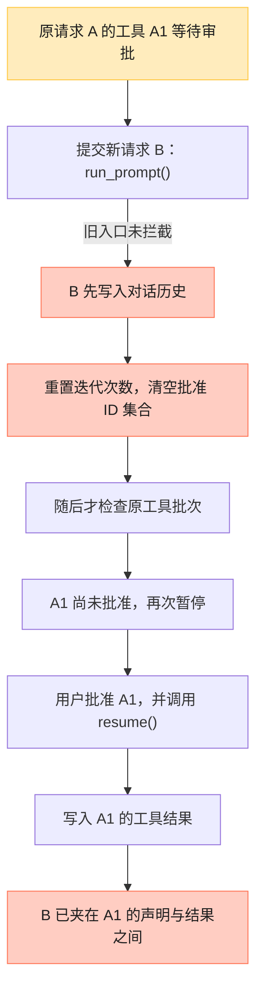
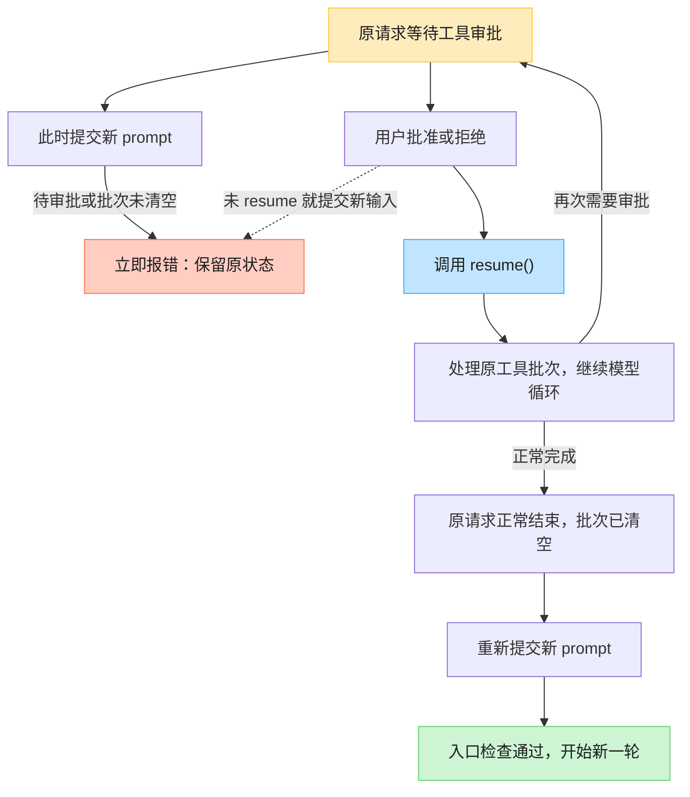

# SDK 待审批时插入新 prompt：问题与修复记录

记录日期：2026-09-07。对象：当前 Python 主项目 `TitanX/` 的 `AgentRuntime`。

## 问题结论

旧实现允许同一个运行时在工具等待人工审批时再次调用 `run_prompt()`。
新用户消息先被写入历史，然后主循环才继续处理原工具批次，导致模型声明的
工具调用与对应结果之间插入新用户消息。同时，新调用还会重置原请求的
迭代次数和已批准工具 ID 集合。

这是 SDK 的入口状态约束缺失，不要求并发调用即可触发。Gateway 的常规
SSE/WebSocket 流程持有会话锁，并在事件回调中等待审批、恢复执行，因此
常规网关路径受到串行保护；直接使用 Python SDK 的宿主不能依赖这层网关锁。

## 修复前：新消息先写入，旧工具后完成

下图对应已复现的单工具场景：原工具尚未批准，就提交通过输入检查的新
prompt。入口缺少状态检查，直到新消息已经写入才重新处理旧工具批次。



问题发生在新请求进入时：**原工具还没处理完，新消息已经修改了对话历史与
原请求状态。** 后续即使正常批准并执行 A1，也不会自动撤销这次错误插入。
如果原批次前面已有获批调用，其批准 ID 也会被这次重置清空。

## 修复后的审批与新输入流程图



红色分支拒绝的是新输入，原请求仍可继续审批与恢复。**批准或拒绝只是作出
决定，还必须调用 `resume()` 处理原流程。** 这张图展示正常审批恢复路径；
异常、取消和预算耗尽的边界见后文。

## 完整触发条件

1. 复用同一个 `AgentRuntime` 实例。
2. 模型返回包含注册工具的 `LlmTurnResult(type="tool_calls")`。
3. 该工具定义设置 `requires_approval=True`，有效策略没有开启自动批准，
   且该调用 ID 尚未获得人工批准。
4. 工具调用通过参数检查，策略返回 `needs_approval`。
5. 运行时保存 `pending_approval` 和 `pending_tool_calls`，停在相应游标，
   以 `signal="stop"`、`last_response_type="need_approval"` 返回宿主。
6. 宿主没有完成批准或拒绝并恢复原流程，而是再次调用 `run_prompt()`。

默认 `auto_approve_tools=False`；工具是否要求审批由其定义和有效策略决定，
不能把所有工具调用都视为必然暂停。

## 修复前的实际复现

本会话此前运行过如下顺序，模型和工具使用本地替身，主循环、安全层、
策略检查、消息结构和审批方法使用仓库实现：

```python
await runtime.run_prompt("request one")
assert runtime.state.pending_approval is not None

# 旧实现没有拒绝这次调用。
await runtime.run_prompt("request two")

runtime.approve_pending_tool()
await runtime.resume()
```

模型首轮只声明一个工具调用时，实际历史角色顺序是：

```text
['user', 'assistant', 'user', 'tool', 'assistant']
```

也就是：

```text
用户请求 A
模型声明工具调用 A1
用户请求 B                 ← 错误插入的位置
工具 A1 的执行结果
模型回答
```

本地替身不会像真实提供方一样校验完整消息协议，所以能继续返回文本。
这不表示消息历史合法。实际提供方是否返回何种错误未在本次调用真实模型
验证；本地已经确认的是消息顺序被破坏，以及原请求状态被意外重置。

## 根因与相邻窗口

旧 `AgentRuntime._run_prompt()` 的顺序是：检查输入 → 追加 `UserMessage` →
重置 `iteration` 与 `approved_tool_call_ids` → 进入 `_run_loop()`。
而恢复旧工具批次的逻辑位于 `_run_loop_inner()`，发生在上述修改之后。

只检查 `pending_approval` 仍然不够：

| 调用阶段 | 为什么仍不应开始新 prompt |
| --- | --- |
| 正在等审批 | 工具声明尚未得到结果 |
| 已调用 `approve_pending_tool()`，尚未 `resume()` | 待审批标记已清除，但调用尚未执行；新 prompt 还会清空刚批准的 ID |
| 已拒绝一个调用，后面还有工具 | 被拒调用有错误结果，但其余调用仍未处理 |
| 拒绝的是批次最后一个工具，尚未 `resume()` | 游标虽已走到末尾，仍需发布拒绝审计和事件、清空批次并完成原模型轮次 |
| 一个批次需要多次审批，停在第二次 | 需要保留第一次批准与已执行结果，不能重置或重放 |

因此，新入口检查需要同时看待审批对象与尚未清空的整个工具批次，而不只
看 `signal` 或“游标后面还有几个工具”。`stop` 也会用于正常完成，不能把
所有 `stop` 都当作等待审批。

## 修复方案

在 `_run_prompt()` 最前面、任何输入扫描和状态修改之前执行：

```python
if self.state.pending_approval is not None or self.state.pending_tool_calls:
    raise RuntimeError(
        "Cannot start a new prompt while a tool-call batch is unfinished. "
        "Resolve any pending approval and call resume() first."
    )
```

选择立即拒绝，不在 SDK 中隐式排队、不替用户批准或拒绝，也不自动把新
输入解释为对原请求的替换。拒绝的新输入不会被保存；宿主可在原流程完成后
重新提交。使用 `RuntimeError` 表示运行时当前状态不允许开始新请求，原有
空输入和超长输入的 `ValueError` 在空闲运行时仍保持不变。

拦截后的约定：

- 原 `AgentState` 及消息列表保持不变，包括游标、迭代次数、批准 ID、
  待审批参数和 token 计数。
- 不新增运行时事件、工具审计或模型调用，不执行工具。
- 批准或拒绝后应调用 `resume()`。如果又遇到下一项审批，继续完成审批循环。
- 原批次和原模型轮次完成后，新 `run_prompt()` 正常接收输入并重置新轮次预算。
- 原运行任务被取消且现有取消清理完成后，待审批与批次被清空，允许新 prompt。

前置判断只读取状态，不改变审批策略或 Gateway 的会话锁。`resume()` 现在与
`run_prompt()` 共用 `_exclusive_execution` 守卫：同一运行时的重叠执行会在改动
状态前被拒绝（在审批钩子内从同一任务发起 `resume()` 除外）。
这不是为 SDK 增加通用并发锁：模型仍在响应但尚未产生工具批次时，多任务
同时操作同一运行时仍需要宿主串行化；本次不扩大线程安全承诺。

## 修复后的调用方式

```python
state = await runtime.run_prompt("原请求")

while state.pending_approval is not None:
    # 宿主在此展示真实工具名和参数，并取得用户决定。
    approved = await ask_user(state.pending_approval)
    if approved:
        runtime.approve_pending_tool()
    else:
        runtime.reject_pending_tool("用户拒绝执行")
    state = await runtime.resume()

# 原请求已不再等待工具审批，且工具批次已处理完成后再提交新请求。
state = await runtime.run_prompt("下一条请求")
```

`ask_user` 是宿主提供的示意函数，不是 TitanX 新增的 API。宿主还应处理
正常执行错误、取消或预算耗尽等原有结束情况。若在审批中提交新请求，捕获
上述 `RuntimeError` 并提示先处理当前审批即可，不能把报错当作默认批准。

## 回归复现与验证

回归文件：`tests/test_runtime_prompt_admission.py`。模拟模型与记录型工具，
使用真实运行时执行；不需要模型密钥、Docker、E2B 或网络。

```bash
cd /Users/wowblk/TitanX/TitanX
.venv/bin/python -m pytest -q tests/test_runtime_prompt_admission.py --tb=short
```

主用例使用“普通工具 → 待审批工具 → 普通工具”的批次：

1. 第一项执行成功，第二项停在审批，确认模型仅调用了一次。
2. 对新 prompt 连续尝试两次，断言抛出提示 `resume()` 的 `RuntimeError`。
3. 对比完整状态快照、消息列表、事件、审计、工具执行记录与模型调用次数，
   确认拒绝不影响原流程。
4. 分别批准或拒绝第二项，`resume()` 后检查每个工具 ID 都有且仅有一条
   对应结果，已执行工具不重放。
5. 原模型轮次完成后再次提交新 prompt，确认能正常回答，迭代次数与批准
   ID 按新轮次重置。

新增 8 个测试场景：

| 场景 | 断言 |
| --- | --- |
| 待审批时插入新输入，随后批准 | 拒绝不改状态，批准后原批次完整执行 |
| 待审批时插入新输入，随后拒绝 | 拒绝不改状态，被拒工具有错误结果，后续工具正常执行 |
| 已批准但未恢复 | 拦截新输入并保留批准 ID，恢复时不重复审批 |
| 拒绝后仍有工具未执行 | 拦截新输入，恢复后补齐结果并发布一次拒绝审计 |
| 拒绝批次最后一个工具 | 仍要求恢复收尾，不因游标耗尽而提前接收新请求 |
| 批次停在第二次审批 | 保留第一次批准、已执行结果和当前游标 |
| 审批事件回调中尝试新输入 | 同样拒绝，事件回调作用域与后续恢复正常 |
| 取消等待审批的原运行任务 | 清理后允许新 prompt，未执行的原工具不会被重放 |

修改生产代码前，新增测试实际结果为 **7 failed, 1 passed**。主要失败是
`DID NOT RAISE <class 'RuntimeError'>`，取消清理后的正常新请求用例原本就通过。
这表示不同入口阶段缺少同一类状态检查，不代表发现了 7 个独立问题。

修复后的实际验证结果（2026-09-07）：

| 检查 | 结果 |
| --- | --- |
| 新增审批准入回归 | 8 个用例全部通过，包含批准、拒绝、再次审批、事件回调和取消清理 |
| 新回归 + 运行时生命周期/取消协议 + Gateway 聊天/加固测试 | **48 passed in 0.59s** |
| Python 编译检查 | 通过 |
| `demo.py` | `Final response: Echo: Hello, TitanX!` |
| `git diff --check` | 通过 |

完整命令：

```bash
cd /Users/wowblk/TitanX/TitanX
.venv/bin/python -m pytest -q tests/test_runtime_prompt_admission.py tests/test_runtime_lifecycle.py tests/test_runtime_cancellation_protocol.py tests/test_gateway_chat.py tests/test_gateway_hardening.py --tb=short
.venv/bin/python -m compileall -q titanx demo.py run_gateway.py
.venv/bin/python demo.py
git diff --check
```

48 项是本次相关测试集合，不是全仓库测试数。全部使用本地替身或本地
ASGI 测试客户端；没有调用真实模型、启动 Docker/E2B 或部署服务。

生产代码修改只位于 `titanx/runtime.py` 的新 prompt 入口及其 API 文档；
使用说明同步补入 `README.md`，发布说明补入 `CHANGELOG.md` 的
Unreleased / Fixed。Gateway 生产代码和审批策略没有修改。

## 范围

本次只修复新 prompt 在待审批或未收尾工具批次期间的准入规则。上下文摘要
累积、压缩触发判断滞后和重试总超时属于独立问题，未在本补丁中修改。
